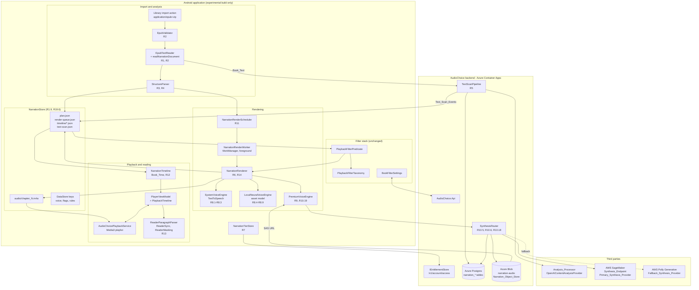
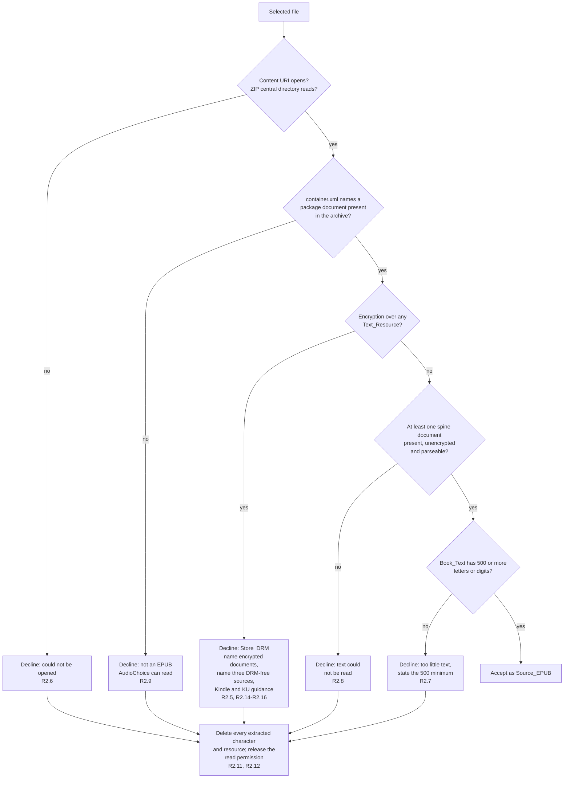
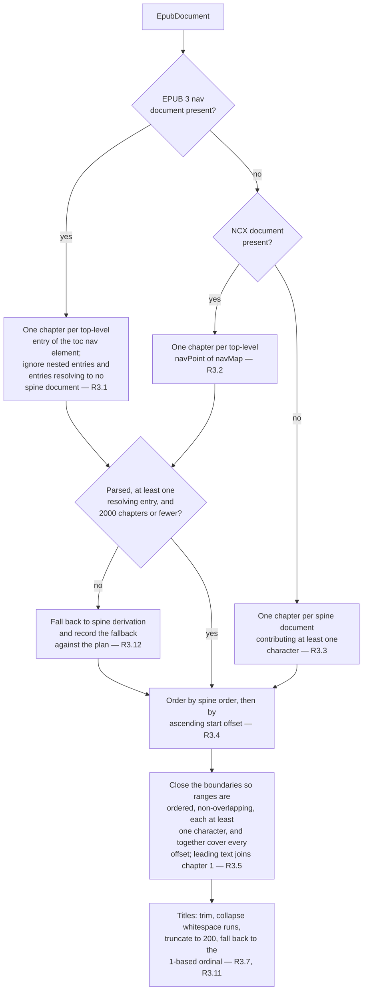
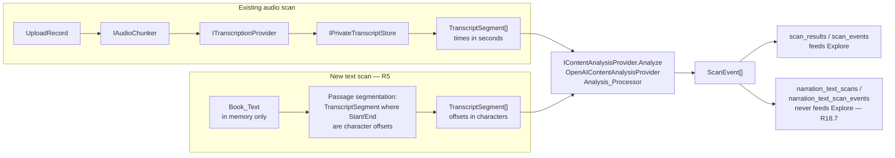
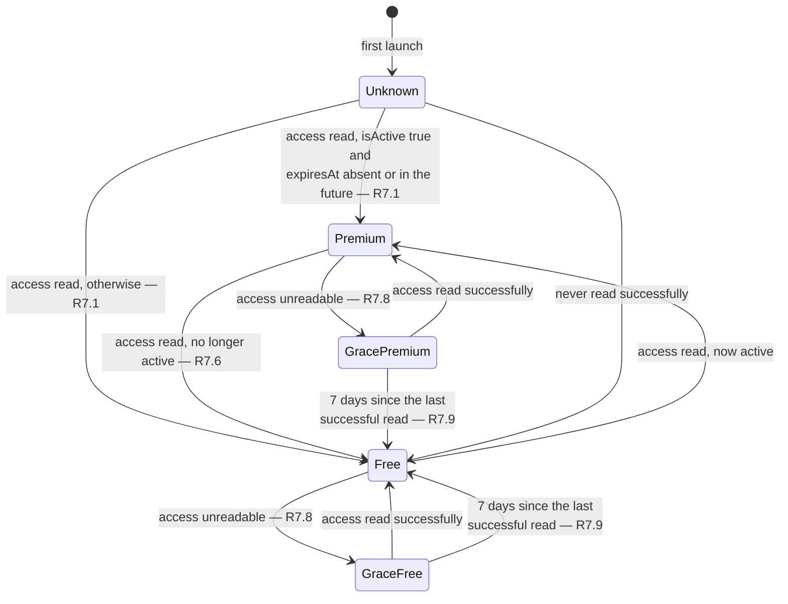
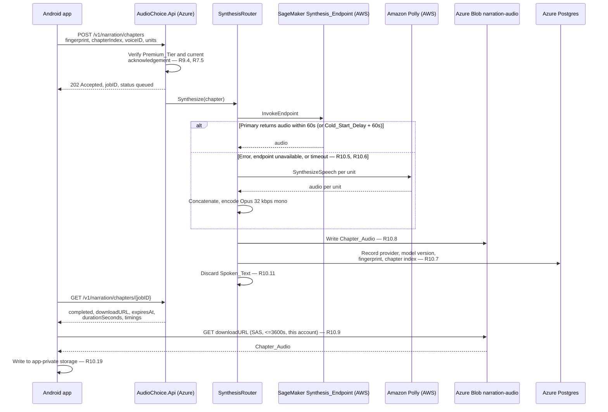
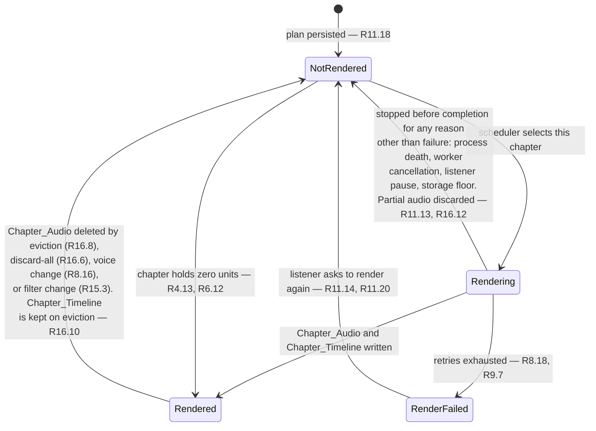
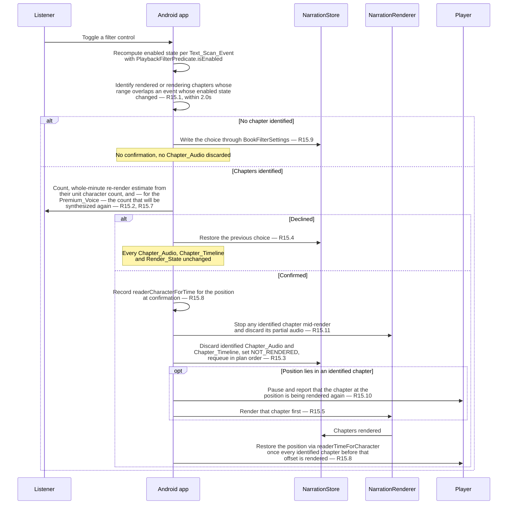

# Design Document

## Introduction

This design implements the approved requirements in
`.kiro/specs/epub-narration/requirements.md`. Every section names the requirements it
implements. Where a requirement cannot be satisfied by the code that exists today, or where two
requirements pull against each other, that is recorded in
[Tensions between the requirements and the existing code](#tensions-between-the-requirements-and-the-existing-code)
rather than resolved silently.

The organising principle is that a Narrated_Book is an ordinary library book whose audio happens
to be produced locally. It is keyed by SHA-256 like every other book, it is upserted through
`PUT /v1/library` like every other book, its filter choices go through `BookFilterSettings`, its
position goes through the existing progress path, and it plays through the existing
`AudioChoicePlaybackService` media session. Three things about it are genuinely new: its audio is
a set of per-chapter files that appear over time rather than one file that exists up front, its
filter events are expressed in character offsets rather than seconds, and its rendering is a
scheduled background job. Everything else is reuse.

Two consequences of that principle drive most of the design.

**One translation layer, not two playback paths.** `PlayerViewModel` reads position and duration
straight off the `MediaController` and treats those numbers as book position and book duration.
For a multi-item playlist those numbers are per-item. Rather than forking the player, a
`PlaybackTimeline` is injected between the controller and every read: identity for an
Imported_Audiobook, cumulative for a Narrated_Book. Filter enforcement, the sleep timer,
completion, bookmarks, chapter controls and progress checkpoints then continue to work on one
number line without knowing which kind of book they are looking at.

**Character offsets must never reach a seconds-shaped field.** `ScanEvent.startTime` and
`endTime` carry character offsets for a Narrated_Book (R5.3). The same `ScanEvent` type is
consumed by `FilterSkipPlanner` through `enforceEnabledFilters`, which would read offset 84,000
as 84,000 seconds and seek 23 hours into a book. Requirement 6.9 forbids planning filter skips
for a Narrated_Book, and this design enforces that by making the presence of narration state the
guard, not by hoping the event list is empty. The same care applies on the backend: text-derived
events are stored in their own table and never enter the scan catalogue that feeds Explore.

Scope is the Android client and the AudioChoice backend, in the `experimental` build type only
(R19).

## Architecture

### Component diagram



### What is new, what is reused, what is modified

| Concern | Decision |
| --- | --- |
| Book identity | Reused. `BookFingerprint` with `fileType = "epub"`, `duration = null`. `audiobook_editions.file_type` is `varchar(255)` and `duration_seconds` is nullable, so R18.6 needs no migration. |
| Per-book local keying | Reused. Every narration value is keyed by the Source_EPUB SHA-256, the same key space `LocalAudioStore` already uses (R1.9). |
| Filter controls, predicate, sync | Reused unmodified: `PlaybackFilterTaxonomy`, `PlaybackFilterPredicate`, `BookFilterSettings` (R5.10–R5.12). |
| Reader | Reused unmodified: `ReaderParagraphParser`, `ReaderSync`, `ReaderMasking`, `ReaderSettings` (R13). |
| Progress, bookmarks, favourites, library list | Reused (R12.6, R12.7, R18.5). |
| Media session | Reused. `AudioChoicePlaybackService` gains nothing; the playlist is set by `PlayerViewModel` (R12.1). |
| `PlayerViewModel` | Modified: a `PlaybackTimeline` indirection, a playlist branch in `open()`, and a narration guard in `enforceEnabledFilters`. |
| `EpubTextReader` | Extended with a narration entry point that returns per-resource offsets, navigation, metadata and an extraction version. The existing `read()` output is untouched. |
| Text extraction of encrypted entries | New: `META-INF/encryption.xml` is parsed (R2.2–R2.5). |
| Chapter structure, non-prose classification, plan | New: `StructureParser` (R3, R4). |
| Voice engines | New: three implementations behind one seam (R8, R9). |
| Backend synthesis | New: `ISynthesisProvider` mirroring `ITranscriptionProvider`, with primary/fallback selection by configuration (R10.1). |
| Backend text scan | New: a pipeline that reuses `IContentAnalysisProvider` and skips transcription (R5). |
| Scan catalogue and Explore | Untouched. Text scans live in their own tables and never become catalogue entries, which is how R18.7 is satisfied. |

### Where the new contracts live

`android-contract/src/main/kotlin/com/audiochoice/contracts/` holds the types that cross the
wire and are shared with the backend; the directory is added to the Android main source set by
`android-app/app/build.gradle.kts`. The root `contracts/` directory holds the versioned content
taxonomy and response fixtures, not Kotlin.

- Wire DTOs go in a new `android-contract/.../contracts/NarrationContracts.kt`, mirrored by
  `backend/AudioChoice.Api/Contracts/NarrationContracts.cs`. They reuse `BookFingerprint` and
  `ScanEvent` from `CloudContracts.kt` rather than declaring narration-specific copies, because
  R5.2 requires the same taxonomy and R5.3 reuses `ScanEvent` exactly.
- Device-only models (`NarrationPlan`, `RenderQueue`, `NarrationChapter`, `NarrationUnit`,
  `PronunciationRule`) go in `android-app/.../data/NarrationModels.kt`. They never cross the
  wire, so putting them in the shared contract would imply a compatibility obligation that does
  not exist.
- Nothing is added under `contracts/`. The taxonomy is unchanged by this feature; R5.2 requires
  that it stay unchanged.

## EPUB validation and text extraction

### What `EpubTextReader` does today and what it lacks

`EpubTextReader.read` unzips the whole archive into a map keyed by lowercased entry name, reads
`META-INF/container.xml` for the package document, builds a manifest and spine from regex
matches, converts each spine document to text, drops leading pages until one looks like the start
of a story, and joins the remainder with `"\n\n"`. It returns one flat string and nothing else.

For narration that is insufficient in four ways, all additive:

1. It has no notion of `META-INF/encryption.xml`, so it cannot implement R2.2–R2.5.
2. It returns no mapping from character offsets back to spine documents, so a navigation entry
   pointing at `chapter3.xhtml` cannot be turned into a Source_Range (R3.1, R3.2).
3. It extracts no chapter titles and no navigation document, so R3.1, R3.2 and R3.7 have no
   input.
4. It preserves no record of which regions came from a `table`, `pre`, `figcaption`, footnote or
   page-break element, so R3.6 and R3.13 have no input.

### The narration extraction entry point

A second entry point is added alongside `read`:

```kotlin
object EpubTextReader {
    /** Unchanged. Imported audiobook reader alignment continues to use this. */
    suspend fun read(resolver: ContentResolver, uri: Uri): String

    /** Narration extraction. Same archive walk, richer result. */
    suspend fun readNarrationDocument(resolver: ContentResolver, uri: Uri): EpubDocument
}

data class EpubDocument(
    /** Book_Text. The coordinate space for every offset in this design. */
    val text: String,
    val extractionVersion: Int,
    val language: String?,
    val title: String?,
    val author: String?,
    val coverImageEntry: String?,
    /** Where each spine document landed in Book_Text, in spine order. */
    val resources: List<ResourceSpan>,
    /** Regions unsuited to narration, already extended over descendants. */
    val nonProseSpans: List<SourceRange>,
    val navigation: NavigationOutline?,
    val encryptedEntries: Set<String>,
    val storeDrmEntries: List<EncryptedTextResource>,
)

data class ResourceSpan(val entryName: String, val start: Int, val end: Int)
data class NavigationOutline(val source: NavigationSource, val entries: List<NavigationEntry>)
data class NavigationEntry(val title: String?, val targetEntry: String, val targetFragment: String?)
enum class NavigationSource { EPUB3_NAV, NCX, SPINE_FALLBACK }
```

`readNarrationDocument` walks the archive exactly once, as `read` does. The `nonProseSpans` and
`resources` lists are produced by the same HTML pass that produces the text, because a second
pass over the source markup would have to reproduce the first pass's whitespace handling
character for character to agree with it. Instead the converter emits into a `StringBuilder` and
records the builder length before and after each element it is asked to mark, which makes the
spans correct by construction.

**Extraction version.** `EpubDocument.extractionVersion` is a constant incremented whenever the
extraction changes, and it is a member of Plan_Inputs by way of the Book_Text hash. Book_Text is
byte-for-byte stable for a given Source_EPUB and a given extraction version, as the glossary
requires, and a change to extraction is detected as a Book_Text hash change (R4.10) rather than
silently reinterpreting old offsets.

**Anchor-precise chapter boundaries.** A navigation entry may target a fragment inside a spine
document (`chapter3.xhtml#part2`). The converter therefore also records the builder offset at
every element carrying an `id`, in an `anchorOffsets: Map<String, Int>` keyed by
`"entryName#id"`. A navigation entry with a fragment resolves to that offset; one without
resolves to the start of its `ResourceSpan`. This is what lets two Narration_Chapters come from
one spine document, which R3.4 explicitly allows for.

### Encrypted resources

`META-INF/encryption.xml` is parsed before any spine document is converted, because R2.12
requires that a Store_DRM decline retain no extracted character:

1. Collect every `CipherReference/@URI` into `encryptedEntries` (Encrypted_Resource).
2. Classify each against the manifest and the container: the package document, the EPUB 3
   navigation document, the NCX document and every spine document are Text_Resources; everything
   else is a Non_Text_Resource.
3. Any Encrypted_Resource that is a Text_Resource is Store_DRM (R2.5). ADEPT_Encryption over a
   Text_Resource is Store_DRM by the same rule, with no separate branch, because
   `EncryptedData` over a spine document is store DRM whichever algorithm it names.
4. Encryption over Non_Text_Resources only is accepted, and those entries are excluded from
   extraction (R2.2). Font_Obfuscation is one instance of that rule and needs no separate code
   path (R2.3). A missing `encryption.xml` is treated as no encryption (R2.4).

Because only spine documents, the package document and the navigation documents ever contribute
to Book_Text, excluding Encrypted_Resources changes Book_Text only for files that are declined
anyway. Extraction output for an accepted file is therefore identical with and without the
encryption pass, which is what keeps Book_Text stable across this change for every file the
feature will actually narrate.

No decryption is attempted anywhere, and no code path reads a `CipherData` payload (R2.13).

### Validator ordering and the single reported reason

`EpubValidator` runs off the main thread within 5.0 seconds for a file of 100 MB or fewer
(R2.17) and reports exactly one reason, evaluated in the order R2.10 mandates:



The Store_DRM check runs before any spine document is converted, so the Store_DRM branch
normally has nothing to purge. `Purge` still runs on that branch because the package document and
the navigation document are read to classify resources, and R2.12 covers "every archive resource
it extracted from that file before the Store_DRM check completed".

The decline surface for Store_DRM is copy, not logic, but it is specified copy: it names which of
the package document, navigation document and spine documents are encrypted (R2.5), names at
least three sources of DRM-free EPUBs, states the Amazon Manage Your Content and Devices route
for DRM-free Kindle purchases with a control that opens that page (R2.14), states that a Kindle
Unlimited borrow offers no EPUB download (R2.15), and states that DRM is the publisher's or
author's choice (R2.16).

## Import and library identity

### Import flow

The library import action offers `application/epub+zip` plus `.epub` by name (R1.1). The existing
EPUB picker in `AudioChoiceApp` already passes
`arrayOf("application/epub+zip", "application/octet-stream", "*/*")` to
`ActivityResultContracts.OpenDocument` because a strict filter made some providers' files
unselectable; the narration picker uses the same array and filters on the `.epub` suffix when the
provider reports a generic type.

Order of operations, all off the main thread:

1. `takePersistableUriPermission` before Book_Text is read (R1.2). Failure means no
   Narrated_Book, no Narration_Plan, and a report that the file could not be opened for reading
   (R1.10).
2. SHA-256 over every byte, plus the byte count, within 30.0 seconds for a file of 50 MB or
   smaller (R1.3). Streamed through `MessageDigest` in one pass over the `InputStream`.
3. Duplicate check against existing Narrated_Books by SHA-256 (R1.8): open the existing book,
   replace the persisted content URI, keep the Narration_Plan, Chapter_Audio and playback
   position, create no second library entry, report that the book is already in the library.
4. `EpubValidator` (R2). A decline ends the import here.
5. `BookFingerprint(version = 1, sha256, fileSize, duration = null, fileType = "epub")`. Duration
   is deliberately absent because a synthesized duration describes the device, not the edition.
6. Title and author from the package metadata: first `dc:title` and first `dc:creator` in
   document order, each truncated to 500 characters (R1.4). No title falls back to the filename
   without its `.epub` extension, or the first 8 characters of the SHA-256 when the provider
   supplies no filename, and records that the title was derived (R1.5). No author is recorded as
   absent and the import completes (R1.11).
7. Cover: the package manifest's cover image, stored through `LocalAudioStore.saveBookCover`,
   which is the existing book cover storage path (R1.6). A missing or undecodable cover stores
   nothing and leaves the existing default library cover in place (R1.12).
8. `PUT /v1/library` with the fingerprint, title, author and cover, unchanged from an audio
   import.
9. Text_Scan (R5.1), then Narration_Plan, then rendering.

Attaching an EPUB to an open Imported_Audiobook keeps its current behaviour through
`PlayerViewModel.attachEpub` and creates no Narrated_Book (R1.7). The two entry points are
distinct: `attachEpub` is reached from the player, narration import from the library.

### Book_Text caching

Book_Text is cached in the narration folder rather than in `LocalAudioStore`'s `epub_text`
directory, because the two are produced by different extraction profiles and a shared cache would
let one overwrite the other for a book that is both narrated and audio-imported. The reasoning
for using a file at all is unchanged from `saveEpubText`: a novel is hundreds of kilobytes to a
few megabytes, and Preferences DataStore holds its whole document in memory and rewrites it on
every edit.

## Structure parsing and the narration plan

### Chapter derivation



Boundary closure (R3.5) is mechanical: sort the derived start offsets, set each chapter's end to
the next chapter's start, set the last chapter's end to `Book_Text.length`, set the first
chapter's start to 0, and drop any chapter whose range would be empty. Coverage and
non-overlap then hold by construction rather than by validation.

The parser completes within 5.0 seconds for a Book_Text of 1,000,000 characters on a device with
four or more cores and runs off the main thread (R3.9, R3.10). It is a single linear pass over
the non-prose spans and a sort of at most 2,000 boundaries; the cost is dominated by the sentence
segmentation described below.

### Non-prose classification

`nonProseSpans` come from the extraction pass, which marks the builder range of every element in
these sets and extends the range over the element's descendants (R3.6):

- Element names: `table`, `pre`, `code`, `figcaption`, `img`.
- EPUB structural semantics (`epub:type`): `footnote`, `endnote`, `pagebreak`, `noteref`, `toc`,
  and additionally `cover`, `titlepage`, `copyright-page`, `colophon`, `landmarks`, `loi`, `lot`
  (R3.13).
- ARIA roles: `doc-footnote`, `doc-endnote`, `doc-pagebreak`.

R3.13 also applies at spine-document granularity: a spine document whose root carries one of
those structural semantics is marked non-prose in full, which is what makes narration begin at
the book's prose rather than at its front matter.

### Chapters as `AudioChapter`

R3.8 requires each Narration_Chapter to be persisted as an `AudioChapter`, whose shape is
`(title, startSeconds, endSeconds)`. A chapter that has not been rendered has no start or end in
Book_Time. The list is therefore regenerated on every Chapter_Audio completion:

- A rendered chapter gets its real `bookStartMs / 1000.0` and its end.
- An unrendered chapter gets `startSeconds = endSeconds = Narration_Duration`, a zero-length
  entry at the end of the rendered audio.

That choice is deliberate and it makes the existing player controls behave correctly with no
change. `PlayerViewModel.previousChapter` uses `indexOfLast { it.startSeconds <= position }` and
`nextChapter` uses `firstOrNull { it.startSeconds > position + 1.0 }`, so an unrendered chapter is
reachable by Next only from inside the last rendered chapter, and seeking to it lands at the end
of rendered audio, which is exactly the behaviour R12.10 specifies. `sleepAtEndOfChapter` uses
`position >= start && position < end`, which a zero-length entry can never satisfy, so the sleep
timer never targets an unrendered chapter.

### Narration_Unit segmentation

R4.1 requires a three-level split, applied to prose only:

1. Sentence boundaries, using `java.text.BreakIterator.getSentenceInstance` for the
   Book_Text_Language. `BreakIterator` is used rather than a punctuation regex because it is the
   platform's own locale-aware segmenter and it does not split on `Mr.` or `1.5`.
2. A sentence longer than the Synthesis_Input_Limit splits at clause boundaries, defined as a
   comma, semicolon, colon, en dash or em dash followed by whitespace.
3. A clause still longer than the limit splits at the last word boundary at or before the limit.

Synthesis_Input_Limit is `min(1000, TextToSpeech.getMaxSpeechInputLength())`. It is read once and
recorded in Plan_Inputs. `getMaxSpeechInputLength` is a static platform value, not a property of
the installed engine, so the plan stays independent of the Selected_Voice as the glossary
requires. A per-engine limit lower than this is handled at render time by R8.19, not by
re-planning.

Invariants held by construction rather than checked afterwards:

- Units index Book_Text and never rewrite it: a unit records `(start, end)` and its
  `sourceCharacters` is always `Book_Text.substring(start, end)` (R4.3). This is the same
  invariant `ReaderParagraph` documents, and it is the reason Spoken_Text is a separate field
  from `sourceCharacters`: Pronunciation_Rules and Filtered_Range exclusion change what is
  spoken, never what the offsets mean (R14.3).
- Units are ordered, non-empty, within their chapter, and non-overlapping, with
  `endCharacter <= next.startCharacter` (R4.2). Gaps are expected and legitimate; they are the
  non-prose regions and the inter-sentence whitespace.
- No unit overlaps a Non_Prose_Block by even one character (R4.4). Segmentation runs over the
  prose sub-ranges produced by subtracting the merged non-prose spans from the chapter range, so
  an overlapping unit cannot be constructed.
- Every unit's Spoken_Text contains at least one letter or digit; a prose span that is all
  whitespace or punctuation yields no unit (R4.5).

A chapter whose prose yields no unit is recorded with zero units and marked as requiring no
rendering (R4.13). A plan that would hold zero units across every chapter is not persisted at
all: the app reports that the Source_EPUB contains no narratable prose and leaves the book
unrendered (R4.14).

**Idempotence (R4.11).** Segmentation is a pure function of Book_Text, the non-prose spans, the
chapter boundaries and the Synthesis_Input_Limit. No random ordering, no hash-set iteration and
no time-dependent input enters it, so the same inputs produce an equal plan on every run.

### Plan persistence and versioning

The plan is a file, not DataStore preferences. This is the same decision `saveEpubText` already
made and for the same stated reason: Preferences DataStore holds its whole document in memory and
rewrites it on every edit. A 20,000-unit plan is roughly 2–4 MB of JSON, and R4.6 requires
serialisation and deserialisation within 2.0 seconds each at that size. Putting it in the shared
preferences document would make every unrelated preference write copy several megabytes, and
would make the render loop's per-chapter state write do the same.

```
filesDir/narration/<sha256>/
    book-text.txt          Book_Text for this extraction version
    plan.json              Narration_Plan, including Plan_Inputs and the spine-fallback flag
    render-queue.json      Render_State per chapter, plus omitted/partial unit counts
    text-scan.json         Text_Scan_Events, scanner version, scan date
    timeline/<index>.json  Chapter_Timeline, chapter-relative times
    audio/chapter_<index>.m4a
    audio/chapter_<index>.m4a.partial
```

`plan.json`, `render-queue.json` and each timeline file are written to a `.tmp` sibling and
renamed, so a process death mid-write cannot leave a half-parsed plan.

Chapter_Timelines are stored **chapter-relative**, with times measured from the first sample of
that chapter's own audio. This is the single most useful property in the timeline design: when an
earlier chapter is re-rendered at a different length (R15.3) or discarded and re-rendered
(R8.16), no other chapter's timeline file needs rewriting. Book_Time is applied at load by adding
the chapter's cumulative start.

Version handling on load:

| Condition | Action |
| --- | --- |
| Recorded Plan_Version differs from current | Discard the plan, report that a new plan is required, keep the Text_Scan_Events because Book_Text is unchanged (R4.9). |
| Recorded Book_Text hash differs from current | Discard the plan and report that both a new plan and a new Text_Scan are required, because every recorded offset is in the old coordinate space (R4.10). |
| Plan cannot be deserialised | Discard the plan, report that a new plan is required, keep the library entry and the content URI (R4.12). |

`Plan_Version` is a constant in `NarrationPlan.Companion`, incremented whenever
`StructureParser` or plan construction changes. It serves the purpose `READER_ALIGNMENT_VERSION`
serves for reader alignment, and it starts at 1.

**Round-trip properties (R4.7, R4.8).** Both are stated as properties over arbitrary plans and
timelines, so both are tested as property-based tests rather than by example. Plan equality is
structural over chapters, titles, ranges, units, Spoken_Text and every Plan_Inputs member.
Timeline equality allows start and end times to differ by up to 1 millisecond, which is why times
are serialised as doubles in seconds rather than as formatted strings.

## Text scanning and filtering

### Where the text scan branches from the audio pipeline

`ScanPipeline.Process` today does three things in order: obtain a transcript (from
`IPrivateTranscriptStore` if complete, otherwise by chunking audio through
`ITranscriptionProvider`), run `IContentAnalysisProvider.Analyze` over the segments, and return a
`ScanResult`. A text scan needs only the second of those. The branch is therefore at the top of
the pipeline, and it is a separate pipeline rather than a flag on the existing one, because the
existing one takes an `UploadRecord` and a text scan has no upload.



`TextScanPipeline` reuses `IContentAnalysisProvider` unmodified by handing it
`TranscriptSegment` values whose `StartTime` and `EndTime` are character offsets rather than
seconds. That is a coordinate-space substitution, not a type change, and it works because the
analysis provider treats those numbers as opaque interval bounds that it copies onto the
`ScanEvent` it returns. This is precisely what R5.3 asks for: events whose `startTime` and
`endTime` are the flagged Source_Range's character offsets.

Passage segmentation for analysis is paragraph-scale rather than sentence-scale, matched to
`options.MaximumSegmentsPerAnalysisRequest` so that request batching, checkpointing and cost
controls behave as they do for audio.

`SceneEventPostProcessor` is **not** applied to a text scan. Its constants are in seconds
(`MergeGapSeconds = 45`, `SafetyPaddingSeconds = 8`, `MinimumCompleteSceneSeconds = 30`) and
applying them to character offsets would merge scenes 45 characters apart and pad every scene by 8
characters. A character-space equivalent is deferred; complete-scene events from a text scan are
returned as the analysis provider produced them. This is recorded as an open point rather than
guessed at.

`DeterministicContentDetector.DetectProfanity` **is** applied, because a literal word match is
exact in either coordinate space and R5.2 requires the same `aggregateKey` and `aggregateDisplay`
so that a censored word presents as one control in `PlaybackFilterTaxonomy`.

### Non-persistence, purpose limitation, and the disclosure

The requirements here are testable constraints, and the design makes them structural rather than
procedural:

- Book_Text arrives in the request body, is bound to a local variable, and is never handed to
  `IPrivateTranscriptStore`, `AudioChoiceDataPaths`, a Postgres command, or a log statement
  (R5.4, R5.5). The request has a 120-second budget enforced by a `CancellationTokenSource`, and
  the handler holds no reference to the text after it returns.
- Only Text_Scan_Events, the scan date, the scanner version and the Source_EPUB fingerprint are
  persisted, and the response body carries no Book_Text (R5.6).
- Purpose limitation (R5.7) is enforced at the seam level: `TextScanPipeline` has exactly one
  outbound dependency, `IContentAnalysisProvider`, and `SynthesisRouter` has exactly two,
  `ISynthesisProvider` implementations. Neither can reach the other's processor.
- A logging test asserts that no log scope in the text scan path captures the text parameter. The
  handler takes Book_Text as a property of a request record, and the record's `ToString` is
  overridden to omit it, because `record` types print every property by default and
  `logger.LogInformation("... {Request}", request)` would otherwise write a whole novel to the
  application log.

The first-use statement (R5.8) says: the book's text is sent to AudioChoice to produce filter
results; AudioChoice sends passages of that text to a third-party model provider that performs the
classification; AudioChoice holds that text only while the scan runs; AudioChoice stores no part
of it; and AudioChoice uses it for no other purpose. It names each category of processor (R5.9):
the AudioChoice backend, the third-party model provider that classifies content, and — where the
Premium_Voice is selected — the AudioChoice-owned Synthesis_Endpoint hosted by Amazon SageMaker
and Amazon Polly as the Fallback_Synthesis_Provider. No Text_Scan is requested and no Book_Text
leaves the device until a Text_Scan_Acknowledgement carrying that statement's version is recorded
(R5.16, R5.17).

### Text scan failure and offline filtering

Three retries with increasing delay, then a report that filter results are unavailable, an offer
to retry, and the book held unrendered until either a scan completes or the listener chooses to
continue without filter results (R5.13). Choosing to continue records that the book has no filter
results and presents that state in the library list and on the detail surface until a scan
completes (R5.14).

A returned event whose start offset is not less than its end, or whose end exceeds the Book_Text
length, invalidates the whole response: the events are discarded, the scan is treated as not
completed, and R5.13 applies (R5.18). Validating the batch rather than dropping the bad event is
deliberate — an out-of-range offset means the server and the client disagree about the coordinate
space, and in that state no event in the batch can be trusted.

Once stored, filtering needs no network: the events are read from `text-scan.json` against the
Source_EPUB SHA-256 together with their scanner version, and no further scan is requested while
that version equals the current scanner version (R5.15).

### Excluding filtered passages from synthesis

Filtered_Ranges are derived by merging the Source_Ranges of every Enabled_Text_Scan_Event
(R6.1). The merge already exists as `List<ReaderMask>.merged()` in `ReaderMasking`, which merges
when `next.start <= previous.end` — exactly the rule R6.1 states, including the touching case
where one range's start equals another's end. `ReaderMask` is reused rather than a parallel type
declared, which also guarantees the reader and the renderer agree about what is filtered.

The 1.0-second bound for 1,000,000 characters and 10,000 events is met by that implementation: one
sort plus one linear fold.

Exclusion happens before Spoken_Text is built, so a filtered character is never spoken, never
stored and never sent (R6.2, R6.3):

| Case | Behaviour |
| --- | --- |
| Filtered_Range covers a unit in full | The unit is omitted from the Render_Queue, no Spoken_Text is submitted, no Chapter_Timeline entry is recorded (R6.4). |
| Filtered_Range covers part of a unit | The uncovered characters are concatenated in ascending offset order with one space at each removal boundary and submitted as one Spoken_Text; one Chapter_Timeline entry is recorded whose Source_Range is the unit's whole range (R6.5). |
| Uncovered characters contain no letter or digit | Treated as covered in full; R6.4 applies (R6.11). |
| No Enabled_Text_Scan_Event exists | Every unit is submitted with no character removed (R6.7). |
| Every unit of a chapter is omitted | No Chapter_Audio is written, an empty Chapter_Timeline is recorded, the chapter's Render_State becomes rendered, and 0.0 seconds are added to Narration_Duration (R6.12). |

Recording the whole unit range for a partially filtered unit (R6.5) is what keeps the reader
honest: `readerDisplayParagraphs` removes the same characters from the display text, so the
highlight covers the unit the listener is hearing and the removed passage is absent from both.

An event with an out-of-range offset stops rendering entirely for that book, reports that the
filter results cannot be applied, and offers to request the scan again (R6.10). This is the same
posture as R5.18 and for the same reason.

**Metamorphic property (R6.6).** A superset of Enabled_Text_Scan_Events yields a
Narration_Duration no greater than a subset does. This holds because enabling an event can only
remove characters from Spoken_Text or remove a unit entirely, and neither can increase synthesized
audio length. It is tested as a property with generated event sets rather than argued from the
code.

**Filter reports for narrated books.** `FilterReportRequest.positionSeconds` carries a character
offset for a Narrated_Book (R17.2). Because a field named `positionSeconds` holding a character
offset is exactly the kind of thing that produces a wrong triage decision two years from now, an
additive optional field records the unit:

```kotlin
@Serializable
data class FilterReportRequest(
    // ... existing fields unchanged ...
    /** Absent means positionSeconds is seconds. "characterOffset" means Book_Text offset. */
    val positionUnit: String? = null,
)
```

The field is optional with a default, so a beta or release client's request body is byte-identical
to today's and R19.7 holds in substance: no existing client's request or response shape changes.
The backend record gains the same optional property and migration 027 adds
`position_unit varchar(20) not null default 'seconds'` to `filter_reports`.

`FilterReportComposer` gains narration variants that set `positionUnit = "characterOffset"` and
express `windowSeconds` as a character look-back rather than a time look-back, because 20 seconds
of audio has no meaning in character space. Missed-content reports use the character offset from
`readerCharacterForTime` for the reported Book_Time (R17.2); wrongly-filtered reports carry the
`scanEventID` and `categoryID` of the Enabled_Text_Scan_Event containing that offset, choosing the
lowest start offset when several contain it (R17.3). No Book_Text, Spoken_Text or narration audio
is included (R17.4). A reported Book_Time that no `ReaderTimingRange` covers sends nothing and
reports that the position maps to no position in the book text (R17.7); a wrongly-filtered report
with no covering event sends nothing and reports that no filtered passage covers the position
(R17.8). Queueing, exactly-once delivery and the 100-report cap are the existing
`FilterReportQueue` behaviour, which already caps at 200 and discards oldest first; the cap is
narrowed to 100 for narration reports per R17.6.

## Entitlement and voice availability

### Tier resolution

Narration_Tier is derived from `Account_Access` alone, never from local purchase state (R7.1,
R7.2). `AccountAccessResponse` already carries `isActive`, `plan`, `source` and `expiresAt`, and
is produced by `IEntitlementStore`, so no backend change is needed to read a tier.



`Account_Access` is read at least every 24 hours while the library holds at least one
Narrated_Book, and on opening a Narrated_Book's voice selection surface (R7.3). Each successful
read records the derived tier, the `plan` value and the read timestamp (R7.10). The
Tier_Grace_Period is 7 days measured from the most recent successful read; past it the tier is
Free and the app reports that the entitlement could not be confirmed (R7.9).

Free_Tier offers the System_Voice and the Local_Neural_Voice and submits no Spoken_Text to the
backend for synthesis (R7.4). Premium_Tier additionally offers the Premium_Voice (R7.5).

A Premium to Free transition on a book with premium-rendered audio keeps every rendered
Chapter_Audio playable, submits no further unit to the Premium_Voice, reports that the premium
voice is no longer available for the account, and offers to render the remaining chapters with an
on-device voice (R7.6). Accepting records the chosen on-device voice as Selected_Voice, keeps the
premium-rendered audio, and renders the rest with the chosen voice (R7.7). This is the one case
where a book's Chapter_Audio files were produced by more than one engine, and it is why
`narration_chapter_renders` records the provider and voice per chapter rather than per book.

No purchase control and no price for the Premium_Tier is presented anywhere (R7.12). During the
experimental cycle Premium_Tier is granted only through the existing
`POST /v1/admin/accounts/{userID}/entitlements`, which is already restricted to the configured
administrator token (R7.11). Selling the Premium_Tier is gated on server-verified Google Play
Billing recorded through the existing entitlement store, tracked outside this document (R7.13).

### The voice engine seam

The seam is per **chapter**, not per unit. Two reasons: the Premium_Voice's unit of work is a
chapter because the backend records provider and model version per chapter (R10.7) and serves
Chapter_Audio per chapter from the object store (R10.8); and building the Chapter_Timeline in one
place is what makes R13.5's exactly-one-range-per-unit property provable.

```kotlin
enum class VoiceKind { SYSTEM, LOCAL_NEURAL, PREMIUM }

data class SpokenUnit(val startCharacter: Int, val endCharacter: Int, val spokenText: String)

data class ChapterRenderRequest(
    val bookKey: String,
    val chapterIndex: Int,
    val language: String,
    val units: List<SpokenUnit>,
    val outputFile: File,
)

sealed interface ChapterRenderOutcome {
    /** Times in [timings] are chapter-relative. */
    data class Rendered(
        val audioFile: File,
        val durationMs: Long,
        val timings: List<ReaderTimingRange>,
    ) : ChapterRenderOutcome

    data class Failed(val reason: String, val retryable: Boolean) : ChapterRenderOutcome
    data object Cancelled : ChapterRenderOutcome
}

interface VoiceEngine {
    val kind: VoiceKind
    val voiceID: String
    /** The engine's own input ceiling, which may be below Synthesis_Input_Limit. */
    val maximumInputCharacters: Int
    suspend fun renderChapter(request: ChapterRenderRequest): ChapterRenderOutcome
}
```

`SystemVoiceEngine` wraps `TextToSpeech.synthesizeToFile`, one call per unit, with
`UtteranceProgressListener` bridged into a `suspendCancellableCoroutine`. Speech rate and pitch are
fixed at 1.0 so the Player's speed control stays the only place playback speed is set (R8.11). No
network request is made and synthesis completes with no connectivity (R8.3).

`LocalNeuralVoiceEngine` runs a neural model held as an application asset of 100 MB or less, makes
no network request during synthesis, and sends no character off the device (R8.4). An absent model
presents its download size in megabytes and downloads only after confirmation (R8.5).

`PremiumVoiceEngine` posts the chapter's units to the backend and downloads the resulting
Chapter_Audio into app-private storage, treating it as that chapter's Chapter_Audio for every
purpose (R10.19).

**Encoding.** On-device engines write one file per chapter by feeding each unit's PCM through a
single `MediaCodec` AAC-LC encoder into a `MediaMuxer`, at 24 kbps mono. Per-unit boundary times
are taken from the running sample count as each unit is appended, which is exact rather than
measured. `synthesizeToFile` produces WAV, so concatenating at the PCM level avoids any container
stitching. Backend-produced audio is 32 kbps mono Opus, as R10.10 requires; that requirement is
about backend output and does not constrain the device. Both formats are natively decodable by
ExoPlayer.

**Long Spoken_Text.** When a unit's Spoken_Text exceeds the engine's `maximumInputCharacters`
after Pronunciation_Rules are applied, the renderer submits it as consecutive synthesis requests
split at word boundaries and still records one Chapter_Timeline entry whose Source_Range is the
whole unit's (R8.19). Applying a rule can lengthen text, which is why this is checked after rule
application and not at plan time.

### Synthesis rate measurement and the local neural gate

```
offered = measuredRate > Playback_Speed_Ceiling * Synthesis_Rate_Margin
        = measuredRate > 2.0 * 1.5
        = measuredRate > 3.0
```

The Local_Neural_Voice is measured before being offered, by synthesizing a fixed measurement text
of 200 to 400 characters and dividing the produced audio's duration by the wall-clock time taken
(R8.6). Above the threshold it is offered (R8.7); at or below it, it is presented as unavailable on
that device with the reason stated, and the System_Voice remains the Selected_Voice (R8.8).

The measurement is recorded against the device, not against a book:
`neural_voice_rate` and `neural_voice_model_version` are device-wide DataStore keys, and the
measurement is repeated when the model version changes (R8.9). The threshold constant 3.0 is
derived from two named constants and is not itself a tunable.

### Default voice and voice changes

A new Narrated_Book records the System_Voice with the installed engine's default voice for the
Book_Text_Language and requires no listener choice before rendering begins (R8.1). The voice
selection surface presents the voices the engine reports for that language (R8.2).

| Failure | Behaviour |
| --- | --- |
| No engine installed, or no successful init within 5.0 seconds | Report that the device has no installed voice, offer to open the Android text-to-speech settings screen, keep the book unrendered (R8.12). |
| No voice for the Book_Text_Language | Report which language the Source_EPUB declares, offer the settings screen, keep the book unrendered until a voice is selected (R8.13). |
| Neural model unloadable, or three consecutive unit errors | Record the System_Voice as Selected_Voice, report that the neural voice is unavailable and narration continues with the system voice, keep every rendered Chapter_Audio playable (R8.14). |
| On-device synthesis error, or no audio file within 30.0 seconds | Retry up to two times; record the chapter as render failed when every attempt fails (R8.18). |
| Recorded voice identifier matches no available voice | Present that the recorded voice is unavailable on the detail surface and offer the voice selection control (R18.10). |

Changing the Selected_Voice presents the count of rendered chapters and requires confirmation
before any Chapter_Audio is discarded (R8.15). Confirming discards every Chapter_Audio and
Chapter_Timeline, resets every Render_State to not rendered, and re-renders under the
Render_Ahead_Window (R8.16). Declining keeps the previous voice and every rendered artifact
(R8.17).

### The premium voice acknowledgement

The Premium_Voice appears on the voice selection surface while the tier is Premium, and stays
unselected until a Premium_Voice_Acknowledgement carrying the current agreement version is
recorded (R9.1, R9.4). The presentation states that the book's Spoken_Text is sent to the
AudioChoice backend for synthesis; that synthesis is performed on the AudioChoice-owned
Synthesis_Endpoint hosted by Amazon SageMaker or by Amazon Polly as the named fallback service;
that AudioChoice retains Spoken_Text only until that request's Chapter_Audio is written; and that
the System_Voice and Local_Neural_Voice remain available and send no text off the device. It
offers an accept control and a decline control (R9.2).

The acknowledgement is account-scoped and carries the agreement version, the agreement text and
the acceptance timestamp (R9.3), and is persisted server-side in
`narration_voice_acknowledgements` (R9.9). When the backend cannot be reached, the acknowledgement
is recorded locally, treated as sufficient to submit Spoken_Text, retained until the backend
confirms it is persisted, and delivered on the backend's next response (R9.10). Declining or
leaving without accepting changes nothing: no voice change, no acknowledgement, no discarded
audio, no submitted text (R9.11). An agreement version change re-presents the statement and stops
further submissions until the new version is acknowledged, while leaving rendered audio playable
(R9.12).

The Premium_Voice is presented as included in the Premium_Tier, with no per-book charge and no
character count, because the tier is a subscription rather than a metered service (R9.5). Each
offered premium voice has a 3.0-to-30.0-second sample, served from
`GET /v1/narration/voices` as a pre-rendered fixed asset, so producing a sample submits no
Spoken_Text from the book (R9.6).

Premium retry policy: on failure or no completion within 30.0 seconds, resubmit at most three
times with 2.0, 4.0 and 8.0 second waits, and record the chapter as render failed when the fourth
attempt fails (R9.7). Loss of connectivity is not a failed attempt: the Render_Queue pauses within
5.0 seconds, consumes no attempt while connectivity is absent, reports that rendering continues
when connectivity returns, leaves rendered audio playable, and resumes within 10.0 seconds of
connectivity returning (R9.8). Distinguishing the two is why `ChapterRenderOutcome.Failed` carries
`retryable` and why connectivity loss returns `Cancelled` instead.

## Backend synthesis

### The provider seam

`ISynthesisProvider` mirrors `ITranscriptionProvider` in shape and in registration, so the
narration pipeline selects a provider by configuration exactly the way the transcription pipeline
selects between `FasterWhisperTranscriptionProvider` and `OpenAITranscriptionProvider` (R10.1).

```csharp
namespace AudioChoice.Api.Processing;

public sealed record SpokenUnit(int StartCharacter, int EndCharacter, string SpokenText);

public sealed record UnitTiming(
    int StartCharacter,
    int EndCharacter,
    double StartTime,
    double EndTime);

public sealed record ChapterSynthesisInput(
    string VoiceID,
    string Language,
    IReadOnlyList<SpokenUnit> Units);

public sealed record SynthesizedChapter(
    string LocalAudioPath,
    double DurationSeconds,
    IReadOnlyList<UnitTiming> Timings);

public interface ISynthesisProvider
{
    string ProviderName { get; }
    string ModelVersion { get; }

    Task<SynthesizedChapter> Synthesize(
        ChapterSynthesisInput input,
        CancellationToken cancellationToken);
}
```

Registration in `Program.cs`, following the existing pattern verbatim:

```csharp
builder.Services.AddSingleton(narrationOptions);
if (narrationOptions.Enabled)
{
    builder.Services.AddSingleton<ISynthesisProvider>(services =>
        string.Equals(narrationOptions.Provider, "sagemaker", StringComparison.OrdinalIgnoreCase)
            ? new SageMakerSynthesisProvider(/* ... */)
            : new PollySynthesisProvider(/* ... */));
    builder.Services.AddSingleton<SynthesisRouter>();
    builder.Services.AddSingleton<ITextScanPipeline, TextScanPipeline>();
}
```

`SynthesisRouter` owns the primary and the fallback and implements the routing rules. The feature
launches with `Provider = "polly"`, so the Fallback_Synthesis_Provider is the provider in effect
and no Synthesis_Endpoint is deployed, because Polly Generative requires no AudioChoice-operated
infrastructure (R10.3).

`PollySynthesisProvider` synthesizes one request per Narration_Unit rather than one per chapter.
Each unit is at most 1,000 characters, comfortably inside Polly's request limit, and per-unit
requests give exact per-unit durations without depending on speech-mark parsing. The unit outputs
are concatenated with `ffmpeg` through the existing `IProcessRunner` abstraction that
`FfmpegAudioChunker` already uses, and encoded once to single-channel Opus at 32 kbps (R10.10),
chosen because the content is speech.

### Fallback routing



Chapter synthesis is a job rather than a synchronous response. A chapter can hold 20,000
characters of Spoken_Text, and holding an HTTP request open for its whole synthesis would put the
render deadline at the mercy of a mobile connection dropping. The client submits, receives a
`jobID`, and polls. The 30-second bound in R9.7 applies to each HTTP interaction — submit, poll,
download — and the 60-second bound in R10.5 applies to the provider call inside the router. See
[Tensions](#tensions-between-the-requirements-and-the-existing-code) for why those two bounds are
read that way.

Routing rules, all in `SynthesisRouter`:

- Primary error, endpoint-unavailable report, or no audio within 60 seconds for one chapter routes
  to the fallback (R10.5).
- A Synthesis_Endpoint scaled to zero that returns no audio within the recorded Cold_Start_Delay
  plus 60 seconds routes to the fallback (R10.6). The Cold_Start_Delay comes from the
  `narration_measurements` table, and until it is measured the router has no value to add, which
  is why R10.13 makes that measurement a prerequisite for deciding whether the endpoint scales to
  zero at all.
- A Primary_Synthesis_Provider not covered by the AWS_Billing_Arrangement means the fallback is
  configured as the provider in effect and no Synthesis_Endpoint is deployed (R10.18). This is a
  deployment-time check recorded in `narration_measurements`, not a runtime branch.

No narration synthesis runs on the Transcription_GPU_Host (R10.4). This is enforced by
configuration separation: `AudioChoice:OpenAI:FasterWhisperEndpoint` and
`AudioChoice:Narration:SageMakerEndpoint` are distinct settings, a startup assertion fails the
process if they resolve to the same host, and `SynthesisRouter` has no reference to
`ITranscriptionProvider`. The isolation is deliberate: a narration request carries a playback
deadline and a transcription chunk does not, and sharing one GPU would let a scan queue delay a
listener.

Spoken_Text is written to no persistent store, log file, cache, checkpoint or telemetry record,
and is retained only until the Chapter_Audio is written to the object store (R10.11). The same
`ToString` suppression used for Book_Text applies to the synthesis request record.

### The cross-cloud boundary

The API and its database are Azure: `deploy-backend.yml` builds the image in Azure Container
Registry and deploys `audiochoice-stg-api` as an Azure Container App, with Azure Database for
PostgreSQL flexible server and Azure Blob Storage for uploads, transcripts and companion
transfers. Premium synthesis is AWS: an AudioChoice-owned SageMaker endpoint and Amazon Polly.
The boundary is explicit and it has costs worth stating:

- **Credentials.** The Azure-hosted API calls AWS regional endpoints over the public internet with
  SigV4, using an access key pair stored in the existing Key Vault alongside
  `postgres-connection-string` and injected as a container app secret. This is a second cloud
  identity to rotate; the alternative, cross-cloud federated identity, is more moving parts than
  this feature justifies.
- **Narration_Object_Store is Azure Blob**, a new `narration-audio` container on the existing
  storage account, not S3. Three reasons. The download URL is issued by the Azure-hosted API, and
  the user-delegation SAS pattern for a single-account, time-bounded URL already exists in
  `BlobCompanionTransferStorage`, which is exactly what R10.9 asks for. Keeping audio in Azure
  means the device never pays a second cross-cloud hop. And a single storage lifecycle means one
  retention policy to reason about rather than two.
- **The cost of that choice** is that synthesized audio transits AWS to Azure before the device
  downloads it, adding one AWS egress charge and one hop of latency per chapter. That hop is
  inside the render-ahead window rather than in front of the listener, which is why it is
  acceptable; if the measured premium Synthesis_Rate turns out to leave no margin, moving the
  object store to S3 with presigned URLs is the change to make, and it is contained to
  `INarrationObjectStore`.

### New endpoints

All narration endpoints are new paths. No existing scan, library, filter report or account
endpoint changes its request or response shape (R19.7), with the single additive exception of the
optional `positionUnit` on `FilterReportRequest` documented above.

**`POST /v1/narration/text-scans`** — R5.1, R5.3, R5.4, R5.6

```jsonc
// Request
{
  "fingerprint": { "version": 1, "sha256": "…", "fileSize": 1048576, "fileType": "epub" },
  "language": "en",
  "bookText": "…"                       // held in memory only, never persisted
}
// Response 200
{
  "events": [
    {
      "id": "…", "startTime": 12045, "endTime": 12132,   // character offsets, R5.3
      "categoryID": "…", "groupID": "…", "eventID": "…",
      "confidence": 0.92, "stableKey": "…",
      "safeDescription": "…", "aggregateKey": "…", "aggregateDisplay": "…"
    }
  ],
  "scanDate": "2025-01-01T00:00:00Z",
  "scannerVersion": "…",
  "taxonomyVersion": "2.0"
}
```

`400` for an empty or oversized `bookText`, mirroring the 8,000,000-character bound
`POST /v1/reader/alignments` already applies. `504` when the 120-second budget expires (R5.4),
which the client treats as a retryable failure under R5.13.

**`POST /v1/narration/chapters`** — R10.7, R10.8, R10.9

```jsonc
// Request
{
  "fingerprint": { … },
  "chapterIndex": 3,
  "voiceID": "…",
  "language": "en",
  "agreementVersion": "1",
  "units": [ { "startCharacter": 40213, "endCharacter": 40298, "spokenText": "…" } ]
}
// Response 202
{ "jobID": "…", "status": "queued" }
```

**`GET /v1/narration/chapters/{jobID}`**

```jsonc
{
  "jobID": "…",
  "status": "completed",                 // queued | synthesizing | completed | failed
  "chapterIndex": 3,
  "provider": "polly-generative",        // R10.7
  "modelVersion": "…",
  "durationSeconds": 512.4,
  "downloadURL": "https://…",            // SAS, this account only, <=3600s — R10.9
  "expiresAt": "2025-01-01T01:00:00Z",
  "timings": [ { "startCharacter": 40213, "endCharacter": 40298, "startTime": 0.0, "endTime": 5.2 } ]
}
```

`403` when the account is not Premium_Tier or holds no acknowledgement at the current agreement
version (R7.5, R9.4).

**`GET /v1/narration/voices`** — R9.6

```jsonc
{
  "agreementVersion": "1",
  "agreementText": "…",
  "voices": [
    { "voiceID": "…", "displayName": "…", "language": "en",
      "sampleURL": "https://…", "sampleSeconds": 12.0 }
  ]
}
```

Samples are pre-rendered fixed assets, so requesting one submits no Spoken_Text from the book.

**`POST /v1/narration/acknowledgements`** — R9.9, R9.10

```jsonc
// Request
{ "agreementVersion": "1", "agreementText": "…", "acceptedAt": "2025-01-01T00:00:00Z" }
// Response 201
{ "id": "…", "agreementVersion": "1", "acceptedAt": "2025-01-01T00:00:00Z" }
```

Idempotent on `(userID, agreementVersion)`, so the offline delivery path in R9.10 can safely
re-send.

## Render scheduling

### Render state machine



A chapter with zero units, whether because its prose yielded none (R4.13) or because every unit was
filtered out (R6.12), goes straight to rendered with no audio file, an empty timeline and 0.0
seconds of duration. It then counts toward the Render_Ahead_Window like any other rendered chapter,
which is correct: there is nothing left to produce for it.

### The scheduling algorithm

```kotlin
/**
 * The single decision point for what to render next. Pure, so the same queue and
 * playhead always select the same chapter, and so the whole policy is testable
 * without a WorkManager or a voice engine.
 */
fun nextChapterToRender(
    states: List<RenderState>,
    playheadChapter: Int,
    renderAheadWindow: Int,
    fullBookRequested: Boolean,
    pausedByListener: Boolean,
): Int? {
    if (pausedByListener) return null                                    // R11.16
    if (fullBookRequested) {                                             // R11.7
        return states.indexOfFirst { it == RenderState.NOT_RENDERED }
            .takeIf { it >= 0 }
    }
    val readyAhead = ((playheadChapter + 1)..states.lastIndex)
        .takeWhile { states[it] == RenderState.RENDERED }
        .count()
    if (readyAhead >= renderAheadWindow) return null                     // R11.4
    return (playheadChapter..states.lastIndex)
        .firstOrNull { states[it] == RenderState.NOT_RENDERED }           // R11.3
}
```

`readyAhead` counts the *contiguous* run of rendered chapters after the playhead rather than the
total number rendered anywhere after it. A gap ahead of the listener is a wall they will hit, so
counting past it would satisfy the window on paper and stall playback in practice.

`RENDER_FAILED` is not `NOT_RENDERED`, so a failed chapter neither blocks the scheduler nor is
retried automatically: the scheduler steps past it to the next not-rendered chapter within 5.0
seconds (R11.14), and it returns to `NOT_RENDERED` only when the listener asks.

Triggers that re-run the decision:

| Trigger | Requirement | Deadline |
| --- | --- | --- |
| Plan persisted with any not-rendered chapter | R11.18 | Start the first chapter within 5.0 s |
| Playhead enters a later chapter | R11.5 | Begin the next required chapter within 5.0 s |
| A chapter reaches rendered | R11.3, R11.4 | Immediate re-evaluation |
| Listener opens a book short of the window | R11.17 | Resume within 5.0 s, without re-rendering an already rendered chapter |
| Full_Book_Render_Request recorded | R11.7 | Immediate |
| Listener pauses or resumes rendering | R11.16 | Stop within 5.0 s |
| Filter change confirmed | R15.3, R15.5 | Chapter at the playhead first |

Exactly one chapter renders at a time for one book (R11.15), enforced by
`WorkManager.enqueueUniqueWork("audiochoice-narration-<sha256>", ExistingWorkPolicy.KEEP, …)`,
the same mechanism `ScanStatusWorker` uses for the active scan. The worker renders one chapter,
persists the outcome, re-evaluates, and either enqueues itself again or completes — a loop of
single-chapter jobs rather than one long-lived job, so a chapter boundary is always a safe
cancellation point and a killed process resumes at a chapter rather than mid-chapter.

`NarrationRenderWorker` runs as a foreground worker via `setForeground`, with a notification
naming the book and the rendered and total chapter counts, removed within 5.0 seconds of rendering
stopping (R11.10). Rendering therefore continues while the app is backgrounded (R11.3).

Partial output is written to `chapter_<n>.m4a.partial` and renamed on success. Any `.partial` file
found when the worker starts is deleted and its chapter reset to not rendered, which is what makes
R11.13 hold across process termination rather than only across clean cancellation.

### Playability and the render frontier

The first chapter to reach rendered makes the book playable from that chapter within 2.0 seconds,
with an indication that chapters remain (R11.2). Rendering the first chapter is bounded at 300
seconds for a chapter of 20,000 characters or fewer with the System_Voice on a device with four or
more cores (R11.19).

Reaching the end of the last rendered chapter while any chapter is not rendered pauses within 1.0
second, keeps the position at that end, and reports that the next chapter is still rendering
(R8.10, R11.11). When the next chapter finishes, the timeline extends within 2.0 seconds and
playback resumes from the kept position, unless the listener has since sought elsewhere, paused, or
opened another book (R11.12). That last condition is tracked by a monotonically increasing
`playbackIntentGeneration` incremented on every seek, pause and book open; the auto-resume carries
the generation it was armed with and does nothing if it no longer matches. A boolean flag would
race with a listener who paused during the render.

Progress presentation while rendering: rendered count, render-failed count, total count and the
title of the chapter currently rendering, updated at least every 2.0 seconds (R11.9).

### Full-book rendering

The detail surface offers a control that records a Full_Book_Render_Request (R11.6). Activating it
presents the count of chapters to be rendered, the estimated storage in megabytes, and — when the
Selected_Voice is the Premium_Voice — that every remaining chapter will be synthesized through a
Synthesis_Provider, and records the request only after confirmation (R11.8). While in effect and
not paused, every chapter renders in plan order regardless of the window (R11.7).

Every chapter failing reports that the book could not be narrated with the Selected_Voice, offers
to render the plan again, offers to change the voice, and keeps the plan and the Text_Scan_Events
(R11.20).

### The Render_Ahead_Window value

The Render_Ahead_Window is at least 1 chapter and is derived from the measured Synthesis_Rate for
the Selected_Voice's engine and the Playback_Speed_Ceiling (R11.21, R10.15). **No value is fixed
in this design, because the Synthesis_Rate it derives from has not been measured** (R10.12,
R10.14). See [Values that must be measured](#values-that-must-be-measured).

The derivation, once the rate exists, is: the window must cover the time to render one chapter at
the measured rate while the listener consumes audio at the Playback_Speed_Ceiling, so
`window = ceil(Playback_Speed_Ceiling / measuredRate) + 1`, floored at 1. At a measured rate of
3.0 — the minimum the Local_Neural_Voice must clear to be offered at all — that yields 2. The
constant is read from a configuration value seeded by the measurement record, not hard-coded, and
the value in effect is recorded alongside the measurement it came from (R10.15).

## Playback

### How a narrated book enters the player

`PlayerViewModel.open()` today resolves a single local URI and returns early when it is null:

```kotlin
if (uri == null) {
    return@launch
}
```

That early return is why an EPUB-only book cannot play. It sits after the scan, bookmark and
filter-settings loads and before the controller is touched, so a narrated book currently loads all
of its metadata and then stops.

The resolution step is replaced by a source type, and the early return becomes a branch:

```kotlin
sealed interface PlaybackSource {
    /** An Imported_Audiobook. One media item, identity timeline. */
    data class SingleFile(val uri: Uri) : PlaybackSource

    /** A Narrated_Book. One media item per rendered Narration_Chapter, in plan order. */
    data class Narration(
        val items: List<MediaItem>,
        val timeline: NarrationTimeline,
    ) : PlaybackSource
}
```

- `SingleFile` behaves exactly as today, including the resume-position-in-`setMediaItem` handling
  and its documented reason.
- `Narration` calls `setMediaItems(items, startIndex, startPositionInItemMs)` where the start
  index and in-item offset come from `timeline.locate(resumeBookTimeMs)`. Supplying the start
  position to `setMediaItems` rather than issuing a `seekTo` after `prepare()` preserves the
  existing protection against a second `open()` adopting a position of 0 while a seek is in flight.
- A narrated book with no rendered chapter loads no playlist, keeps playback stopped, and reports
  that there is no rendered narration to play yet (R12.14). This replaces the silent early return.

`mediaItemFor` becomes `mediaItemsFor`, setting the same title, artist and artwork metadata on
every item so the media notification and lock screen are correct regardless of which chapter is
playing (R12.9). Each item's `mediaId` is `"<bookID>#<chapterIndex>"`, and the adoption check in
`open()` compares the book portion, so returning to a backgrounded narrated book still adopts its
running playback rather than restarting it.

### Book_Time

```kotlin
/**
 * The one place per-chapter audio becomes one continuous position space.
 *
 * Chapter_Timelines are stored chapter-relative, so re-rendering one chapter at a
 * different length never invalidates another chapter's stored timings. Book_Time is
 * applied here, at load, by accumulating durations.
 */
class NarrationTimeline(private val chapters: List<RenderedChapter>) {
    data class RenderedChapter(
        val planIndex: Int,
        val bookStartMs: Long,
        val durationMs: Long,
        val timings: List<ReaderTimingRange>,   // chapter-relative
    )

    /** Narration_Duration: rendered chapters only, so it grows as rendering proceeds. */
    val totalDurationMs: Long = chapters.sumOf { it.durationMs }

    /** Book_Time from a Media3 (item index, in-item position). */
    fun bookTimeMs(itemIndex: Int, positionInItemMs: Long): Long =
        chapters.getOrNull(itemIndex)?.let { it.bookStartMs + positionInItemMs } ?: 0L

    /** The inverse, for seeking. Binary search over bookStartMs. */
    fun locate(bookTimeMs: Long): Pair<Int, Long>

    /** Narration_Timeline: chapter timings offset into Book_Time and concatenated. */
    val narrationTimingRanges: List<ReaderTimingRange> = chapters.flatMap { chapter ->
        chapter.timings.map {
            it.copy(
                startTime = it.startTime + chapter.bookStartMs / 1000.0,
                endTime = it.endTime + chapter.bookStartMs / 1000.0,
            )
        }
    }
}
```

`narrationTimingRanges` is ordered by both start time and start character (R12.13) because
chapters are in plan order, plan order is spine order, and units ascend within a chapter. That
ordering is what `readerCharacterForTime`'s binary search over time and
`readerTimeForCharacter`'s scan over characters both already assume, so `ReaderSync` is reused
without modification.

**The round-trip property (R12.12).** A character offset converted by `readerTimeForCharacter` and
back by `readerCharacterForTime` falls within the Source_Range of the unit containing the original
offset. This holds because narration timings are dense and non-overlapping within a chapter, and
both functions interpolate linearly within the same range. It is the property that fails first if
timings are ever built anywhere other than in the voice engine seam, which is why it is a
property-based test rather than an example.

### The `PlaybackTimeline` indirection

`PlayerViewModel` reads position and duration in several places — `trustedPositionMs`,
`rawDurationMs`, the polling loop, `enforceEnabledFilters`, `sleepAtPositionMs`,
`markFinishedIfAtEnd`, `seekTo`, `previousChapter`, `nextChapter`, `saveProgress`,
`saveProgressSync`, `checkpointProgress`, `addBookmark`, `reportMissedContent`. Translating at
each call site would guarantee that one of them is missed. Instead a single interface sits between
the controller and every read:

```kotlin
interface PlaybackTimeline {
    fun bookPositionMs(controller: MediaController): Long?
    fun bookDurationMs(controller: MediaController): Long
    fun seek(controller: MediaController, bookTimeMs: Long)
}

/** Imported_Audiobook: one item, so the controller's numbers are already book numbers. */
object DirectPlaybackTimeline : PlaybackTimeline

/** Narrated_Book: cumulative across rendered chapters. */
class NarrationPlaybackTimeline(private val timeline: NarrationTimeline) : PlaybackTimeline
```

`trustedPositionMs` becomes
`liveTransport?.let { playbackTimeline.bookPositionMs(it) }?.coerceAtLeast(0L)` and `rawDurationMs`
becomes `liveTransport?.let { playbackTimeline.bookDurationMs(it) } ?: lastKnownDurationMs`. Every
downstream caller keeps working on one number line. The existing protections around
`liveTransport` — that a disconnected controller reports 0 and must never poison a checkpoint —
are unchanged, because they guard the controller, not the arithmetic.

With that in place the requirements fall out of existing code:

| Requirement | Satisfied by |
| --- | --- |
| R12.1 | `setMediaItems` in plan order through the existing media session, positioned at the recorded Book_Time or 0.0. |
| R12.2 | `bookDurationMs` returns Narration_Duration. A chapter entering or leaving rendered rebuilds the timeline, and the polling loop republishes duration within its 100–250 ms tick, well inside 2.0 s. |
| R12.3 | `setPlaybackSpeed` with `localAudio.playbackSpeed(sha256)`, unchanged. |
| R12.4 | `seekTo(bookTimeMs)` clamps below 0 and at Narration_Duration, then `timeline.locate` gives `(index, offset)` for `controller.seekTo(index, offset)`. Cross-chapter seeks are ordinary playlist seeks; 0.25 s is comfortable for a local file. |
| R12.5 | `previousChapter` and `nextChapter` operate on the regenerated `AudioChapter` list in Book_Time; `skip` moves in Book_Time by the configured interval. |
| R12.6 | The existing progress path, at the existing 15-second cadence plus pause and stop, now recording Book_Time. |
| R12.7 | The existing bookmark path, at Book_Time positions. |
| R12.8 | The existing sleep timer, which pauses through `controller.pause()` and calls `saveProgress()`. |
| R12.11 | `BookCompletion.isComplete` against Narration_Duration, guarded by R12.16 below. |
| R12.15 | A `PlaybackException` on a chapter item pauses at that chapter's `bookStartMs`, retains the recorded position, and reports that the chapter must be rendered again. |

Two narration-specific guards:

- **R12.16** is the important one. `markFinishedIfAtEnd` runs on every poll tick against
  `rawDurationMs`, and for a narrated book that duration is only the rendered chapters. A book
  with chapter 3 of 40 rendered would be marked finished the moment playback reached the end of
  chapter 3. `markFinishedIfAtEnd` therefore returns early unless every chapter is rendered.
- **R12.10** seeking past Narration_Duration, or into a chapter that is not rendered, positions at
  the end of the last rendered chapter, pauses, and reports that the position is not yet rendered.

### The filter-skip guard

```kotlin
private fun enforceEnabledFilters(positionMs: Long, allowLookAhead: Boolean) {
    val current = mutableState.value
    // A Narrated_Book's narration contains no Filtered_Range, so there is nothing to
    // skip. This guard is not an optimisation: its ScanEvent startTime and endTime are
    // character offsets into Book_Text, and FilterSkipPlanner would read offset 84,000
    // as 84,000 seconds and seek almost a day into a book that is hours long.
    if (current.narration != null) return                     // R6.9
    if (current.scanEvents.isEmpty()) return
    // ... unchanged ...
}
```

The guard is the presence of narration state, not an empty event list, because a narrated book's
event list is normally *not* empty.

The same coordinate confusion reaches the filter control tree.
`PlaybackFilterTaxonomy.available` sorts events by `startTime` and surfaces it as
`PlaybackFilterEvent.startTime`, which the UI renders as a timestamp. R5.11 requires the same
control tree for both kinds of book, so the taxonomy is not modified; instead, for a narrated book,
`PlaybackFilterEvent.startTime` is populated by mapping the character offset through
`readerTimeForCharacter`, and left null when the containing chapter is not yet rendered. The
control tree is identical and the displayed time is true.

## Reader

The reader needs no modification. Its inputs already exist in the right coordinate space.

| Requirement | Implementation |
| --- | --- |
| R13.1 | `ReaderParagraphParser.parse(Book_Text)`, off the main thread as `paragraphsFor` already does. |
| R13.2 | `readerCharacterForTime(narrationTimingRanges, bookTimeSeconds)`, highlighting the containing paragraph via `indexOfCharacter`, on the existing polling tick, which is well inside 500 ms. |
| R13.3 | Tap seeks to `readerTimeForCharacter` for the paragraph's first covered offset, then `seekTo` in Book_Time. |
| R13.4 | `readerDisplayParagraphs(paragraphs, filteredRanges.map { ReaderMask(it.start, it.end) })`. A paragraph covered in full renders not at all. |
| R13.6, R13.7 | The existing reader position path and device-wide `ReaderSettings`, unchanged. |
| R13.8 | A Non_Prose_Block has no Narration_Unit and therefore no timing range, so no highlight can land on it while its text still renders. |
| R13.9 | The existing follow-audio scroll, within 500 ms of a highlight change. |
| R13.10 | A tapped paragraph with no covered offset leaves the position unchanged and reports that the tapped text has no narration yet. |
| R13.11 | `readerCharacterForTime` returning null keeps the last highlight and scrolls not at all — the documented behaviour of `ReaderSync` across a gap. |

R13.5 — exactly one `ReaderTimingRange` per unit of a rendered chapter whose range no
Filtered_Range covers in full — is what makes narration coverage complete rather than sparse, and
it is the structural difference from audio alignment. `ReaderAlignment.Create` skips any transcript
segment it cannot confidently anchor, and `ReaderSync`'s comments describe that sparseness as
expected. Narration has no anchoring problem: the offsets are known before synthesis, so coverage
is total. `ReaderSync` still returns null across a gap, which now only happens at non-prose regions
and at unrendered chapters.

## Pronunciation rules

A rule is a written form and a replacement form, each 1 to 100 characters after trimming, scoped
either to one Narrated_Book or to the account (R14.1). Book-scoped rules are persisted against the
Source_EPUB SHA-256 with their recording order; account-scoped rules are persisted against the
account and apply to every Narrated_Book (R14.4, R14.5).

Rules apply to Spoken_Text only, after Filtered_Range exclusion and before submission, and never
to Book_Text (R14.2, R14.3). That ordering is what keeps character offsets, the reader and the
filtered ranges unaffected by a rule, and it is why a written form is never matched across the
boundary of an excluded Filtered_Range: the boundary is a removal, and matching across it would
recognise a word that the listener will not hear.

Matching is case-insensitive with non-alphanumeric boundaries: the characters immediately before
and after a match must each be absent or be neither a letter nor a digit (R14.7). Application is a
single left-to-right pass in ascending offset order, at most one rule per character, and never over
characters already substituted (R14.8). Where two rules match at the same offset, a book-scoped
rule wins over an account-scoped rule, and the earlier-recorded rule wins within one scope
(R14.8). The single pass matters: a naive sequence of independent replacements lets rule B rewrite
rule A's output, so a rule mapping "Rhysand" to "Reesand" followed by one mapping "and" to "und"
would produce "Reesund".

Recording, editing or deleting a rule presents the count of rendered chapters containing at least
one match under that matching rule, offers to render them again, and discards no Chapter_Audio
until the offer is accepted (R14.6). Because rules never touch Book_Text, counting matches is a
scan of the rendered chapters' Spoken_Text and needs no re-planning (R14.4).

Validation: an empty or over-long form records nothing, names which form is out of bounds, and
retains what the listener typed (R14.10). A written form duplicating an existing rule of the same
scope, case-insensitively, records nothing, says so, and offers to edit the existing rule (R14.11).
A 200-rule limit per scope records nothing, says the limit is reached, and leaves every persisted
rule unchanged (R14.12).

A preview speaks the replacement form with the Selected_Voice, beginning within 3.0 seconds and
speaking for no more than 10 seconds (R14.9), through the same `VoiceEngine` used for rendering so
the preview is the voice that will actually say it.

## Re-rendering on a filter change



Recording a character offset rather than a Book_Time at confirmation (R15.8) is the point of the
whole flow: re-rendering changes chapter durations, so the Book_Time the listener was at no longer
denotes the same words. The character offset does, and it is the coordinate the reader and the
filter events already use.

Playback continues uninterrupted while an identified chapter is re-rendered, as long as the
position lies in a chapter that was not identified (R15.6). Because the timeline is rebuilt from
chapter durations and the affected chapter is not the current media item, this is a playlist item
replacement via `replaceMediaItem` rather than a playlist reset.

## Storage

Chapter_Audio is written to app-private storage, under
`filesDir/narration/<sha256>/audio/` (R16.4).

That directory is deliberately **not** one of `LocalAudioStore.PURGEABLE_AUDIO_DIRECTORIES`
(`playback_audio`, `incoming`, `converted-audiobooks`). `purgeOrphanedAudioFiles` only walks those
three and only considers files unreferenced by an `audio_` preference key, so narration audio is
outside its reach entirely. R16.11 — that the orphan purge treats Render_Queue-referenced audio as
referenced — is therefore satisfied by construction, with no reference-counting logic added to a
path that already had a subtle bug history.

| Requirement | Implementation |
| --- | --- |
| R16.1 | Pre-render estimate in megabytes from the Render_Queue's total Spoken_Text character count and the Selected_Voice's bitrate: characters → seconds via a per-engine characters-per-second constant, seconds → bytes via the encoder bitrate. The 30% accuracy bound is why the constant is per engine rather than global. |
| R16.2 | An estimate exceeding free space on the app-private volume less the 1.0 GB Storage_Reserve reports the shortfall in megabytes, keeps every chapter not rendered, and keeps the plan and the Text_Scan_Events. |
| R16.3 | Free space measured before each chapter and at least every 30.0 seconds during one. |
| R16.5 | Per-book storage presented as the total byte count of its Chapter_Audio files, updated within 5.0 seconds of a write or delete. |
| R16.6, R16.13 | A discard-all control presents the reclaimable megabytes and the count needing re-render, discards nothing until confirmed, and keeps the plan, the Chapter_Timelines, the Text_Scan_Events, the Pronunciation_Rules and the position. |
| R16.7 | Deleting a book deletes the whole `narration/<sha256>/` directory and the book-scoped rules, keeps the account-scoped rules, and releases the persisted read permission on the Source_EPUB content URI. Hooked into the existing `LocalAudioStore.remove` path that `LibraryViewModel.delete` calls. |
| R16.8, R16.9 | Eviction, disabled by default, deletes the Chapter_Audio of chapters ending more than 2 chapters before the playhead's chapter and holding no bookmark, when playback passes a chapter's last offset. |
| R16.10 | Deleting a Chapter_Audio sets the chapter to not rendered and keeps its Chapter_Timeline, which is possible only because timelines are chapter-relative and stored separately from audio. |
| R16.12 | Free space at or below the Storage_Reserve stops rendering within 5.0 seconds, discards the partial audio, keeps rendered audio and the queue, and reports that the device is low on storage. |
| R16.14 | A failed deletion during book removal deletes the rest, keeps the book absent from the library, and reports that some narration data could not be removed. |

A bookmark blocks eviction (R16.8), which requires mapping a bookmark's Book_Time to a chapter. That
is `timeline.locate`, and it is why bookmarks are stored in Book_Time rather than as chapter-relative
positions.

## Library presentation

| Requirement | Implementation |
| --- | --- |
| R18.1 | A synthesized-narration indication on every library list row and the detail surface for a Narrated_Book, and on no Imported_Audiobook. |
| R18.2 | Rendered and total chapter counts on any book holding a not-rendered chapter, both updated within 2.0 seconds of a chapter entering rendered. |
| R18.3 | The Selected_Voice name and its kind on the detail surface. |
| R18.4, R18.8 | Fully rendered books present Narration_Duration as the duration in hours and minutes; partially rendered books present the rendered duration with an indication that it covers rendered chapters only. |
| R18.5 | Narrated_Books sort and filter alongside Imported_Audiobooks with the same keys and controls; a book with no Narration_Duration sorts after every book with a duration when ordered by duration. |
| R18.6 | The backend records the book as a library book with `fileType = "epub"` and `duration` absent. `audiobook_editions.file_type` is `varchar(255)` and `duration_seconds` is nullable with a `coalesce` upsert, so no migration is needed and library, favourites and progress sync apply unchanged. |
| R18.7 | Narrated_Books never reach Explore. Explore publication is driven by `ScanCatalog`, whose publishable set comes from `scan_results` entries; a text scan writes to `narration_text_scans` and never creates a catalogue entry. The exclusion is structural, not a filter that could be forgotten. |
| R18.9 | A render-failed indication and the failed count on the library row. |
| R18.10 | An unavailable-voice indication and the voice selection control on the detail surface. |

## Data models

### Device models

```kotlin
// android-app/.../data/NarrationModels.kt — local only, never on the wire.

@Serializable
data class NarrationPlan(
    val planVersion: Int,
    val inputs: PlanInputs,
    val chapterDerivationFellBackToSpine: Boolean,   // R3.12
    val chapters: List<NarrationChapter>,
) {
    companion object {
        /** Increment whenever StructureParser or plan construction changes. R4.9. */
        const val PLAN_VERSION = 1
    }
}

@Serializable
data class PlanInputs(
    val sourceSha256: String,
    val bookTextHash: String,          // R4.10
    val extractionVersion: Int,
    val planVersion: Int,
    val synthesisInputLimit: Int,
    val enabledEventKeys: List<String>,
    val pronunciationRuleFingerprint: String,
)

@Serializable
data class NarrationChapter(
    val index: Int,
    val title: String,                 // 1..200 chars, R3.7
    val startCharacter: Int,
    val endCharacter: Int,
    val units: List<NarrationUnit>,    // may be empty, R4.13
)

@Serializable
data class NarrationUnit(
    val startCharacter: Int,
    val endCharacter: Int,
    /** Always equals Book_Text.substring(startCharacter, endCharacter). R4.3. */
    val sourceCharacters: String,
)

@Serializable
enum class RenderState { NOT_RENDERED, RENDERING, RENDERED, RENDER_FAILED }

@Serializable
data class RenderQueue(
    val states: List<RenderState>,
    val chapterDurationsMs: List<Long>,
    /** R6.8: per chapter, units omitted in full and units partially removed. */
    val omittedUnitCounts: List<Int>,
    val partiallyRemovedUnitCounts: List<Int>,
    val failureReasons: Map<Int, String> = emptyMap(),
)

@Serializable
data class SelectedVoice(val kind: VoiceKind, val voiceID: String)

@Serializable
data class PronunciationRule(
    val writtenForm: String,           // 1..100 after trimming, R14.1
    val replacementForm: String,
    val order: Int,                    // recording order, R14.4
)
```

### Local storage layout

Files, under `filesDir/narration/<sha256>/` — see
[Plan persistence and versioning](#plan-persistence-and-versioning) for the layout and the reason
these are files rather than DataStore entries.

DataStore keys added to the existing `local_audio_files` preferences store, following the existing
`<name>_<sha256>` convention:

| Key | Scope | Purpose |
| --- | --- | --- |
| `narration_voice_<sha>` | Book | Selected_Voice (R8.1) |
| `narration_flags_<sha>` | Book | One JSON blob: Full_Book_Render_Request, listener pause, eviction enabled, text-scan state, continued-without-filter-results (R5.14, R11.6, R16.9) |
| `narration_pronunciations_<sha>` | Book | Book-scoped rules (R14.4) |
| `narration_pronunciations_account` | Device | Account-scoped rules (R14.5) |
| `narration_tier`, `narration_tier_read_at`, `narration_tier_plan` | Device | Last derived tier and read timestamp (R7.8, R7.10) |
| `narration_text_scan_ack` | Device | Text_Scan_Acknowledgement version, text, timestamp (R5.17) |
| `narration_premium_ack` | Device | Premium_Voice_Acknowledgement, pending delivery flag (R9.3, R9.10) |
| `neural_voice_rate`, `neural_voice_model_version` | Device | Measured Synthesis_Rate (R8.9) |

`LocalAudioStore.remove(sha256)` gains removal of the book-scoped keys and the
`narration/<sha256>/` directory (R16.7). This extends the existing list of keys that method already
removes, and the comment there records why leaving keys behind was a bug worth fixing once.

### Backend schema

One additive, forward-only migration, `backend/Database/Migrations/027_epub_narration.sql`, applied
by `PostgresDatabaseInitializer` in filename order like every other migration.

```sql
-- Text-derived filter results. Deliberately a separate table from scan_events: those
-- carry seconds, these carry character offsets into Book_Text, and one query reading
-- the other would produce a filter skip almost a day into a book. Keeping them apart is
-- also what keeps a Narrated_Book out of the Explore catalogue, which is built from
-- scan_results. R5.3, R5.6, R18.7.
create table if not exists narration_text_scans (
    id uuid primary key,
    fingerprint_version integer not null,
    sha256 char(64) not null,
    file_size bigint not null,
    language varchar(35),
    scanner_version varchar(64) not null,
    taxonomy_version varchar(16) not null,
    book_text_characters integer not null,
    scanned_at timestamptz not null,
    unique (fingerprint_version, sha256, file_size, scanner_version)
);

-- No Book_Text column, by design. R5.5, R5.6.
create table if not exists narration_text_scan_events (
    id uuid primary key,
    scan_id uuid not null references narration_text_scans(id) on delete cascade,
    start_character integer not null,
    end_character integer not null,
    category_id uuid not null,
    group_id uuid not null,
    event_id uuid not null,
    confidence double precision not null,
    stable_key varchar(128) not null,
    safe_description text not null,
    aggregate_key varchar(128),
    aggregate_display text,
    check (start_character >= 0 and end_character > start_character)
);
create index if not exists narration_text_scan_events_scan_idx
    on narration_text_scan_events (scan_id, start_character);

-- Which provider produced each chapter, so a Premium-to-Free transition can leave
-- premium audio in place beside system-voice audio and still be explicable. R7.6, R10.7.
create table if not exists narration_chapter_renders (
    id uuid primary key,
    user_id uuid not null references users(id) on delete cascade,
    fingerprint_version integer not null,
    sha256 char(64) not null,
    file_size bigint not null,
    chapter_index integer not null,
    voice_id varchar(128) not null,
    provider varchar(64) not null,
    model_version varchar(128) not null,
    duration_seconds double precision not null,
    object_path varchar(512) not null,
    created_at timestamptz not null,
    unique (user_id, sha256, chapter_index, voice_id)
);

-- R9.9. Idempotent on the agreement version so the offline delivery path in R9.10 can
-- re-send without creating a second record.
create table if not exists narration_voice_acknowledgements (
    id uuid primary key,
    user_id uuid not null references users(id) on delete cascade,
    agreement_version varchar(32) not null,
    agreement_text text not null,
    accepted_at timestamptz not null,
    unique (user_id, agreement_version)
);

-- The values R10.12 through R10.15 require to be measured rather than assumed, and the
-- Render_Ahead_Window derived from them. A table rather than configuration because the
-- requirement is that the measurement be recorded with what it was measured on.
create table if not exists narration_measurements (
    id uuid primary key,
    kind varchar(64) not null,        -- premium_synthesis_rate | cold_start_delay
                                      -- | local_neural_synthesis_rate
                                      -- | billing_coverage_verified
    measured_value double precision not null,
    measured_at timestamptz not null,
    target varchar(128) not null,     -- SageMaker instance type or device model
    software_version varchar(128) not null,
    render_ahead_window integer,      -- the value in effect, R10.15
    notes text
);

-- R17.5. Optional with a default, so a beta or release client's request body is
-- unchanged and R19.7 holds.
alter table filter_reports
    add column if not exists position_unit varchar(20) not null default 'seconds';
```

### Migration story

**Device.** Nothing to migrate. Narration is new, exists only in the experimental build, and has
its own application ID and therefore its own private storage. `Plan_Version` starts at 1 and
`extractionVersion` at 1. A plan written by a build with a different version is discarded and
rebuilt (R4.9, R4.10, R4.12), so version handling is the migration mechanism and there is no
separate one.

**Backend.** Migration 027 is additive: four new tables and one nullable-by-default column. No
existing table changes shape, no existing query changes meaning, and a beta or release client sees
identical responses (R19.7). The migration is forward-only, matching the existing convention; there
is no down-migration path in `PostgresDatabaseInitializer` and this migration does not introduce
one.

## Sequence flows

### Import through the first playable chapter

```mermaid
sequenceDiagram
    autonumber
    participant L as Listener
    participant App as Android app
    participant V as EpubValidator
    participant E as EpubTextReader
    participant S as StructureParser
    participant API as AudioChoice.Api
    participant AP as Analysis_Processor
    participant W as NarrationRenderWorker
    participant TTS as SystemVoiceEngine
    participant P as Player

    L->>App: Choose an EPUB from the library import action
    App->>App: takePersistableUriPermission — R1.2
    App->>App: SHA-256 and byte count, off the main thread — R1.3
    App->>App: Existing Narrated_Book with this hash? — R1.8
    App->>V: Validate
    V->>V: container.xml, encryption.xml, spine, 500-character floor
    alt Declined
        V-->>App: Exactly one reason — R2.10
        App->>App: Purge extracted text and resources,<br/>release the read permission — R2.11, R2.12
        App-->>L: Reason, and where DRM-free EPUBs come from
    else Accepted
        V-->>App: Source_EPUB
        App->>E: readNarrationDocument
        E-->>App: Book_Text, resource spans, non-prose spans,<br/>navigation, metadata, extraction version
        App->>API: PUT /v1/library<br/>fileType epub, duration absent — R18.6
        App-->>L: First-use text-scan statement — R5.8, R5.9
        L->>App: Acknowledge — R5.17
        App->>API: POST /v1/narration/text-scans (Book_Text)
        API->>AP: Classify passages
        AP-->>API: Labels
        API->>API: Persist events only, discard Book_Text — R5.4, R5.5, R5.6
        API-->>App: Text_Scan_Events in character offsets — R5.3
        App->>App: Validate every offset; a bad one invalidates<br/>the batch — R5.18
        App->>S: Parse structure and build the plan
        S-->>App: Narration_Plan, AudioChapter list — R3, R4
        App->>App: Record System_Voice as Selected_Voice — R8.1
        App-->>L: Storage estimate in megabytes — R16.1
        App->>W: Enqueue unique work for this book — R11.18
        W->>W: Derive Filtered_Ranges, apply<br/>Pronunciation_Rules — R6.1, R14.2
        W->>TTS: renderChapter(chapter 0)
        TTS-->>W: Audio, duration, chapter-relative timings
        W->>W: Rename .partial, set RENDERED,<br/>persist timeline and queue
        W-->>App: Chapter 0 rendered
        App->>P: setMediaItems with one item — R12.1
        App-->>L: Playable, chapters remain to render — R11.2
        W->>W: Re-evaluate: readyAhead vs<br/>Render_Ahead_Window — R11.3, R11.4
    end
```

### Premium synthesis with fallback, from the listener's side

```mermaid
sequenceDiagram
    autonumber
    participant L as Listener
    participant App as Android app
    participant T as NarrationTierStore
    participant API as AudioChoice.Api
    participant R as SynthesisRouter
    participant SM as SageMaker (AWS)
    participant Polly as Polly (AWS)
    participant Blob as narration-audio (Azure)

    L->>App: Open the voice selection surface
    App->>T: Read Account_Access — R7.3
    T->>API: GET /v1/account/access
    API-->>T: isActive, plan, expiresAt
    T-->>App: Premium_Tier — R7.1
    App->>API: GET /v1/narration/voices
    API-->>App: Voices, sample URLs, agreement version and text
    L->>App: Play a sample, then select the Premium_Voice
    App-->>L: What selecting this sends off the device — R9.2
    alt Declined or dismissed
        App-->>L: Nothing changes — R9.11
    else Accepted
        App->>App: Record the acknowledgement locally — R9.3
        App->>API: POST /v1/narration/acknowledgements
        alt Backend unreachable
            App->>App: Keep the local record and a pending flag;<br/>submission is allowed — R9.10
        end
        App-->>L: Rendered chapter count, confirm before discarding — R8.15
        L->>App: Confirm
        App->>App: Discard every Chapter_Audio and timeline,<br/>reset every Render_State — R8.16
        loop Each chapter the window requires
            App->>API: POST /v1/narration/chapters<br/>units with filtered characters already removed — R6.3
            API->>API: Verify tier and agreement version — R7.5, R9.4
            API-->>App: 202, jobID
            API->>R: Synthesize
            R->>SM: InvokeEndpoint
            alt Endpoint errors, is unavailable, or exceeds its budget
                SM-->>R: error or timeout — R10.5, R10.6
                R->>Polly: SynthesizeSpeech per unit
                Polly-->>R: Audio per unit
                R->>R: Concatenate, encode Opus 32 kbps mono — R10.10
            else Endpoint returns audio
                SM-->>R: Audio
            end
            R->>Blob: Write Chapter_Audio — R10.8
            R->>R: Record provider and model version;<br/>discard Spoken_Text — R10.7, R10.11
            App->>API: GET /v1/narration/chapters/{jobID}
            API-->>App: completed, SAS downloadURL, duration, timings
            App->>Blob: Download
            Blob-->>App: Chapter_Audio
            App->>App: Write to app-private storage,<br/>extend the timeline — R10.19, R11.12
        end
    end
    Note over App,API: Connectivity loss pauses the queue within 5.0s,<br/>consumes no retry attempt, and resumes within<br/>10.0s of connectivity returning — R9.8
```

## Values that must be measured

Requirement 10 requires four things to be established by measurement rather than assumed, and
Requirement 11 makes the Render_Ahead_Window depend on two of them. **None of these values exists
today.** They are stated as unmeasured here rather than given a plausible-looking number, because a
Render_Ahead_Window derived from a guess is a listener waiting mid-chapter or a premium bill for
chapters nobody reached.

Each measurement is persisted as a Narration_Measurement_Record carrying the value, the date, the
instance type or device, and the software version measured (glossary, `narration_measurements`).

| # | Value | Requirement | What to measure | On what | Gates |
| --- | --- | --- | --- | --- | --- |
| 1 | Premium Synthesis_Rate | R10.12 | Seconds of Opus audio produced per second of wall clock, for a full Reference_Chapter of 15,000–25,000 characters, measured end to end from request submission to the last audio sample, including concatenation and encoding | The Amazon SageMaker instance type chosen for the Synthesis_Endpoint, and separately Polly Generative from the Azure Container App that will call it, so the cross-cloud hop is inside the measurement | Fixing any Render_Ahead_Window value (R10.15, R11.21). Also determines whether R9.7's 30-second and R10.5's 60-second bounds are achievable at all |
| 2 | Cold_Start_Delay | R10.13 | Wall clock from a request reaching a Synthesis_Endpoint scaled to zero instances until the first audio sample of that request | The same SageMaker instance type, from cold, repeated enough times to see the spread rather than one lucky sample | Deciding whether the Synthesis_Endpoint scales to zero at all, and supplying the budget in R10.6's routing rule |
| 3 | Local_Neural_Voice Synthesis_Rate | R10.14, R8.6 | Duration of produced audio divided by wall clock, for the fixed 200–400 character measurement text | A Mid_Range_Device: 6 GB RAM, 8 CPU cores, system-on-chip released 3 to 5 years before the measurement | Offering the Local_Neural_Voice at all. It must exceed 3.0, being Playback_Speed_Ceiling 2.0 times Synthesis_Rate_Margin 1.5 (R8.7, R8.8) |
| 4 | Provider choice and billing coverage | R10.16, R10.17 | A side-by-side comparison of one Reference_Chapter rendered **in full** by each provider, judged on long-form pacing consistency and dialogue handling; plus written confirmation that the chosen provider, including any AWS Marketplace model software charge levied separately by SageMaker JumpStart, is covered by the AWS_Billing_Arrangement | Both providers, same chapter, same voice character | Deploying a Synthesis_Endpoint. Not covered means the fallback becomes the provider in effect and no endpoint is deployed (R10.18) |

Two constraints on how these are taken:

- The provider comparison must not be made on samples shorter than a Reference_Chapter (R10.16). A
  short sample exercises neither long-form pacing consistency nor dialogue handling, which are the
  two things that decide whether a listener finishes a forty-hour book.
- Measurement 1 must be taken from the Azure Container App that will make the call in production,
  not from a workstation. The cross-cloud hop described in
  [The cross-cloud boundary](#the-cross-cloud-boundary) is part of the number that matters.

Until measurements 1 and 3 exist, the Render_Ahead_Window has no value, the Local_Neural_Voice is
not offered, and the derivation in
[The Render_Ahead_Window value](#the-render_ahead_window-value) is a formula with an unknown input.

## Tensions between the requirements and the existing code

These are places where a requirement and the code as it stands do not simply agree. Each states
what the design does about it.

### 1. `EpubTextReader.read` drops front matter with a keyword heuristic

The glossary defines Book_Text as the output of `EpubTextReader.read`. That method calls
`trimFrontMatter`, which drops every spine document before the first one whose opening 600
characters match `prologue`, `chapter one` or `part one`. R3.13 takes the opposite approach: keep
the text and classify front matter as a Non_Prose_Block using declared EPUB structural semantics.

The two are not contradictory — a dropped document simply yields no chapter under R3.1's
"entries whose target resolves to no spine document" — but they are redundant, and the heuristic is
strictly worse than the classification: it is a keyword guess that fails on any book whose first
division is named anything else, and when it fires it removes text the Reader would otherwise
display.

**Decision.** `readNarrationDocument` does not trim front matter. It retains every spine document
in Book_Text and relies on R3.13's classification, which is declaration-driven rather than a guess.
`read` keeps trimming, so cached reader alignments for Imported_Audiobooks — keyed on
`READER_ALIGNMENT_VERSION` — are unaffected. Two extraction profiles exist, each recorded in
`extractionVersion`.

**Deviation to note.** This means Book_Text for a Narrated_Book is not literally the output of
`EpubTextReader.read`. It is the output of the same component under a narration profile. Every
property the glossary requires of Book_Text still holds: one flat string, the coordinate space for
every offset, byte-for-byte stable for a given file and extraction version.

### 2. `enforceEnabledFilters` would read character offsets as seconds

R5.3 puts character offsets in `ScanEvent.startTime` and `endTime`. R6.9 says the Player must plan
no filter skip for a Narrated_Book. `enforceEnabledFilters` guards only on
`scanEvents.isEmpty()`, and a Narrated_Book's event list is normally not empty, so without a new
guard the player would seek to offset-as-seconds — offset 84,000 becomes 84,000 seconds, about 23
hours.

**Decision.** The guard is `current.narration != null`, checked before the empty-list check, with a
comment recording the failure it prevents. The same substitution reaches
`PlaybackFilterTaxonomy`'s displayed `startTime`, handled by mapping through
`readerTimeForCharacter` as described in [The filter-skip guard](#the-filter-skip-guard).

This is worth naming as a design smell that the requirements accept deliberately: reusing a
seconds-named field for characters is what buys `PlaybackFilterPredicate`,
`PlaybackFilterTaxonomy`, `BookFilterSettings` and `ReaderMasking` unmodified, which is R5.10
through R5.12. The price is that every consumer of `startTime` must now know which kind of book it
holds. The alternative — a parallel `TextScanEvent` type — would have forced parallel filter
plumbing, which is exactly what the requirements say not to build.

### 3. `markFinishedIfAtEnd` would finish a book on its third chapter

R12.2 makes duration the Narration_Duration of *rendered* chapters. `markFinishedIfAtEnd` runs
every poll tick and calls `BookCompletion.isComplete(position, duration)`, which is true within 30
seconds of the end or at 98% of duration. A book with 3 of 40 chapters rendered would be marked
finished, synced as finished, and — because `setFinished(true)` clears the stored playback speed —
would also silently reset the listener's chosen speed.

**Decision.** R12.16 requires exactly this: `markFinishedIfAtEnd` returns early unless every
chapter is rendered. R12.11 then applies only to a fully rendered book.

### 4. R9.7's 30 seconds and R10.5's 60 seconds cannot both bound a whole chapter

R9.7 bounds a Premium_Voice synthesis request at 30.0 seconds before a retry. R10.5 bounds a
provider's response for one Narration_Chapter at 60 seconds before falling back. A chapter can hold
20,000 characters of Spoken_Text, which is roughly 25 minutes of speech. If either bound meant
"the whole chapter is synthesized and delivered", both would be unsatisfiable at any synthesis rate
below about 25×.

**Decision.** R9.7's 30 seconds bounds each HTTP interaction — submission, poll, download — which
is why chapter synthesis is a job rather than a synchronous response. R10.5's 60 seconds bounds the
provider call inside `SynthesisRouter`, which is achievable for a batch TTS API where a
1,000-character unit returns in well under a second, but is not achievable for a real-time
streaming voice.

**This interpretation is load-bearing and depends on measurement 1.** If the measured premium
Synthesis_Rate is near or below real time, R10.5 cannot be met as written and the requirement needs
revisiting rather than the implementation stretching to fit.

### 5. `AudioChapter` has no representation for an unrendered chapter

R3.8 requires persisting Narration_Chapters as `AudioChapter(title, startSeconds, endSeconds)`. A
chapter that has not been rendered has neither a start nor an end.

**Decision.** Zero-length entries at the current Narration_Duration, as described in
[Chapters as `AudioChapter`](#chapters-as-audiochapter). This makes the existing chapter and
sleep-timer controls behave correctly with no change to them, and it makes Next-into-an-unrendered-
chapter land exactly where R12.10 says it should. It does mean an `AudioChapter` list for a
partially rendered book contains entries that do not describe real audio, so any future consumer of
that list must treat a zero-length chapter as "not yet rendered". That is recorded here rather than
left to be discovered.

### 6. `SceneEventPostProcessor` constants are in seconds

R5.2 requires text-derived events to carry the same category, group and event identifiers as an
audio scan, which includes the complete-scene event that `SceneEventPostProcessor` produces. Its
constants — 45-second merge gap, 8-second padding, 30-second minimum — are meaningless as character
counts.

**Decision.** The post-processor is not applied to a text scan. Complete-scene events are returned
as the analysis provider produced them. A character-space equivalent needs its own thresholds
derived from measured prose density, and inventing three constants here would be guessing. Recorded
as an open point; the consequence is that a text scan may produce several adjacent complete-scene
events where an audio scan would produce one merged event, which affects how many controls a
listener sees, not what is filtered.

### 7. `FilterReportRequest.positionSeconds` carries a character offset

R17.2 puts a character offset in a field named `positionSeconds`, and R17.5 requires that the
report record that it did. R19.7 requires existing endpoint shapes to be unchanged.

**Decision.** An additive optional `positionUnit`, absent for every existing client, plus a
defaulted column in `filter_reports`. No existing client's serialised request changes by a byte, so
R19.7 holds in substance. Renaming the field would have been cleaner and would have broken iOS,
Android release, and the admin filter-report views at once.

### 8. `EXPERIMENTAL_BUILD` is declared but never read

`android-app/app/build.gradle.kts` defines `EXPERIMENTAL_BUILD` for all three build types, but no
Kotlin source reads `BuildConfig.EXPERIMENTAL_BUILD` today. R19.2 makes it the gate for this entire
feature.

**Decision.** `NarrationConfig.enabled = BuildConfig.EXPERIMENTAL_BUILD`, mirroring
`BetaConfig.enabled`, as the single place the flag is read. Noted because it means this feature is
the flag's first consumer, so there is no existing gating pattern to follow and no existing
behaviour to regress.

## Experimental gating and data isolation

`NarrationConfig` is the single source of truth, in the shape `BetaConfig` already established:

```kotlin
object NarrationConfig {
    /** R19.1, R19.2. The only place BuildConfig.EXPERIMENTAL_BUILD is read. */
    val enabled: Boolean get() = BuildConfig.EXPERIMENTAL_BUILD
}
```

While `enabled` is false, no EPUB narration import action is presented, no narration surface is
composed, and no Narrated_Book can be created (R19.2). The gate is applied at composition sites
rather than inside each component, so a narration screen cannot be reached by any navigation route
in a beta or release build. Beta and release builds present the same surfaces, request the same
permissions, and apply the same playback, filtering and reader behaviour to an Imported_Audiobook as
they do today (R19.3) — which the `PlaybackTimeline` indirection preserves by making
`DirectPlaybackTimeline` behaviourally identical to reading the controller directly.

No new build type and no new product flavour is introduced. The `experimental` type already exists
and is created with `initWith(getByName("beta"))` (R19.4). Its `BETA_VERSION` field advances from
`"Experimental 1"` when narration first ships (R19.5).

Data isolation needs no code. `applicationIdSuffix = ".experimental"` gives the experimental build
its own application ID, hence its own `filesDir` and its own `local_audio_files` DataStore
document. A beta or release install on the same device sees no Narrated_Book and cannot read or
alter narration data (R19.6). This is worth stating precisely because it means the isolation cannot
regress through a code change — only through removing the suffix.

The backend narration endpoints are additive paths. Every existing scan, library, filter report and
account endpoint keeps its request and response shape, so a beta or release client is unaffected
(R19.7).

## Testing strategy

The requirements state several properties over all inputs, and those are tested as properties
rather than examples. The rest are example-based tests at the seams.

**Property-based, on the device (JVM unit tests over generated Book_Text and event sets):**

- Plan round-trip: deserialising a serialised plan yields an equal plan (R4.7).
- Timeline round-trip: within 1 millisecond on times, exact on offsets and order (R4.8).
- Plan idempotence: equal plans across runs for the same Book_Text and Plan_Inputs (R4.11).
- Unit invariants: `substring(start, end) == sourceCharacters`, ordered, non-overlapping, within
  the chapter, no non-prose overlap, at least one letter or digit (R4.2–R4.5).
- Chapter coverage: ranges ordered, non-overlapping, each at least one character, together
  covering every offset (R3.5).
- Filter monotonicity: a superset of enabled events never increases Narration_Duration (R6.6).
- Character-to-time round-trip: an offset converted to Book_Time and back lands within the
  containing unit's range (R12.12).
- Timeline density: exactly one range per unrendered-excluded unit of a rendered chapter (R13.5).
- Pronunciation single-pass: no rule applies to characters another rule substituted, and at most
  one rule applies per character (R14.8).

**Example-based, at the seams:**

- Validator decline ordering, one reason per file, over a fixture set covering each branch of
  R2.10, including an ADEPT-encrypted spine document, a font-obfuscated-only archive, a missing
  `container.xml`, and a 400-character book.
- Extraction stability: the same file yields byte-identical Book_Text across runs and across
  process restarts, at a fixed extraction version.
- Text-scan non-persistence: a scan request leaves no Book_Text substring in any file under
  `AudioChoiceDataPaths.Root`, in any log sink, or in any Postgres table (R5.4–R5.6). Asserted by
  searching for a marker string embedded in the test's Book_Text.
- Scheduler decisions: `nextChapterToRender` is pure, so the whole of R11.3, R11.4, R11.7 and
  R11.16 is a table test over states, playhead, window and flags.
- Tier state machine: each transition in the R7 diagram, including the grace boundary at exactly 7
  days.
- Fallback routing: primary error, primary timeout, cold-start budget exceeded, and billing not
  covered (R10.5, R10.6, R10.18), with a fake `ISynthesisProvider` pair.
- Filter-skip guard: a narrated book with events whose offsets exceed its duration in seconds
  issues no seek (R6.9). This test exists specifically to fail if the guard is ever removed.
- Completion guard: a partially rendered book playing to the end of its rendered audio is not
  marked finished (R12.16).
- Media3 playlist behaviour: appending a chapter mid-playback does not interrupt the current item;
  replacing an earlier item does not move the playhead (R11.12, R15.6).
